## Introduction
In this lab, the E155 development board was assembled and tested to confirm the NUCLEO-32 MCU and UPduino v3.1 FPGA functionality. A design was implemented on the FPGA to control an on-board LED with the on-board high-speed oscillator, as well as control two additional on-board LEDs and an external 7-segment display using combinational logic of four switch inputs.

## Design and Testing Methodology
To design the LED and 7-segment display implementation, two submodules were created and linked by a top-level module. The top level module included combinational logic to control two of the on-board LEDs based on four switch inputs, and called the two submodules and HSOSC to control the oscillating on-board LED and the 7-segment display.

One submodule controled a counter that would "step down" the 24MHz clock generated from the HSOSC to a 2.4Hz clock. The maximum count value of the counter was calculated as shown in Figure 1.

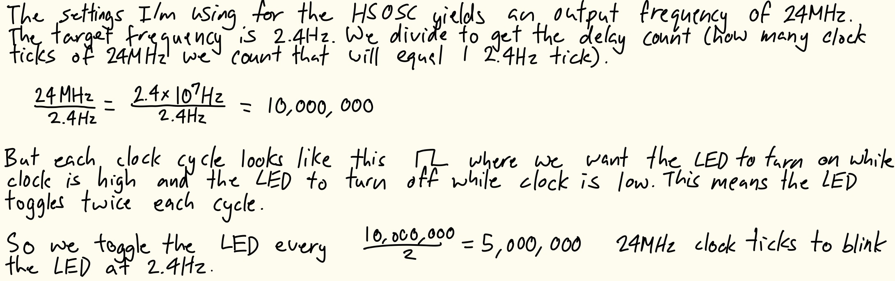

The counter was also given a reset and enable input for additional functionality in case the submodule needs to be used in a future design. The reset, tied to a button input, resets the counter to 0 when pressed. The enable input, tied to a constant high signal from the top-level module, allows the counter to run as expected when high and hold its current value when low. When the counter reached the maximum count value, it reset to 0 and inverted the output signal. This would act as the on-board LED toggle. 

The other submodule implemented the combinational logic to control the 7-segment display based on the 4 switch inputs. Because of the large number of output signals, the combinational logic was implemented using a case statement instead of a series of implied logic gates.

The design was tested using waveform simulation of the top-level module and each submodule in QuestaSim through automatic testbenches to confirm the desired behaviour.

The counter submodule testbench instantiated the submodule freqconverter (with parameters WIDTH and MAX set to 4 and 10 respectively) under a test and generated a clock signal with a cycle time of 2ns. To start testing, enable and reset were first toggled so they were high. Then, the output signal was checked at every MAX number of clock signals to confirm the desired ON/OFF frequency. The reset was then toggled after a small delay and the output signal was checked again with the same intervals to confirm the reset put the counter value back at 0. The enable was then set to low and the same tests were performed to confirm the counter stopped running when enable was low.

The 7-segment display submodule testbench instantiated the submodule switch_7seg under a test, then went through each combination of four switch inputs while checking the seven segments were outputting the correct values.

The top-level module was tested in three separate testbenches. First was a testbench to test the clock generated by the HSOSC. The top-level output clk signal was checked at the time it takes to complete half a 24MHz clock cycle twice to confirm the signal is oscillating high/low at the 24MHz.

Another testbench was written to test the combinational logic of the on-board LEDs and the connection to the 7-segment submodule. Similar to the 7-segment display submodule testbench, this testbench instantiated the top-level module lab1_nk under a test, then went through each combination of four switch inputs while checking the on-board LEDs were outputting the correct values and the seven segments were being mapped to the top-level seven segment outputs.

The final top-level testbench tested the connection to the counter submodule. After instantiating the top-level module lab1_nk under a test, the reset signal was toggled high, and the oscillating LED signal was checked every half stepped-down clock signal to confirm the submodule output signal was oscillated at the right frequency and being mapped to the LED. The reset signal was toggled after a small delay and the oscillating LED signal was checked at the same interval to confirm the reset put the counter back at 0 and did not affect the signal mapping.

Finally, the 7-segment display circuit was built and connected to the FPGA GPIO pins, and the full design was uploaded to the FPGA and deployed on the hardware. The design was tested by toggling the switches to account for all cases and observing the LED and 7-segment display outputs ton confirm functionality, as well as probing the output oscillating signal with an oscilloscope to confirm its frequency is 2.4Hz.

To implement this design on hardware, the GPIO pins needed to be connected to current-limiting resistors before the 7-segment display diodes. The resistor values were calculated as shown in Figure 2.

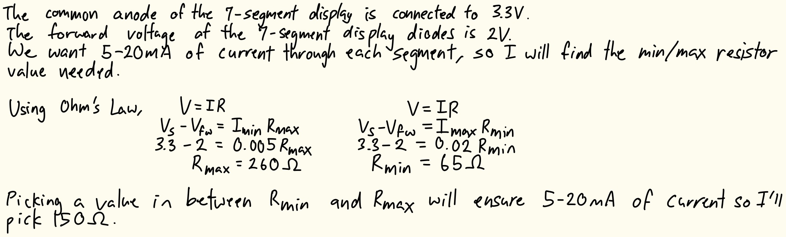

## Technical Documentation
The source code for the project can be found in the associated [GitHub repository](https://github.com/natalieko2024/E155-Labs/tree/main/E155-Lab1).

### Block Diagram
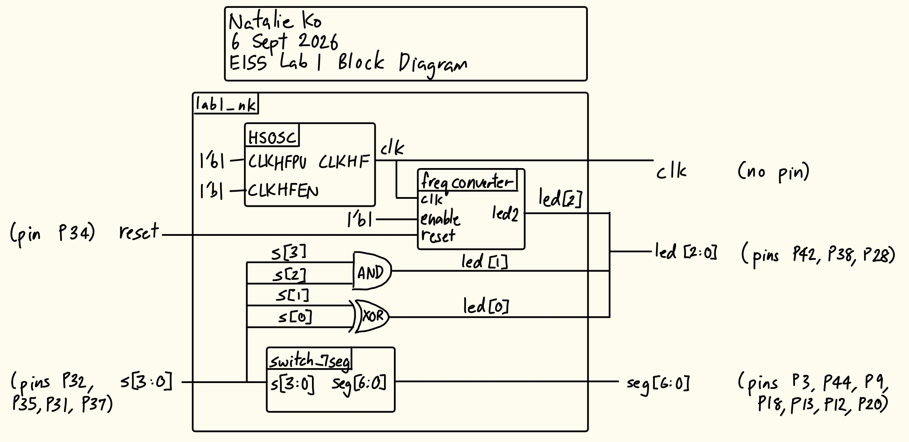

The block diagram in Figure 3 shows the overall architecture of the design. The top-level module lab1_nk includes three submodules: the high-speed oscillator (HSOSC), the counter module (freqconverter), and the 7-segment display module (switch_7seg). The top-level module also contains an XOR gate and an AND gate which determine the combinational logic of the two on-board LEDs.

### Schematic
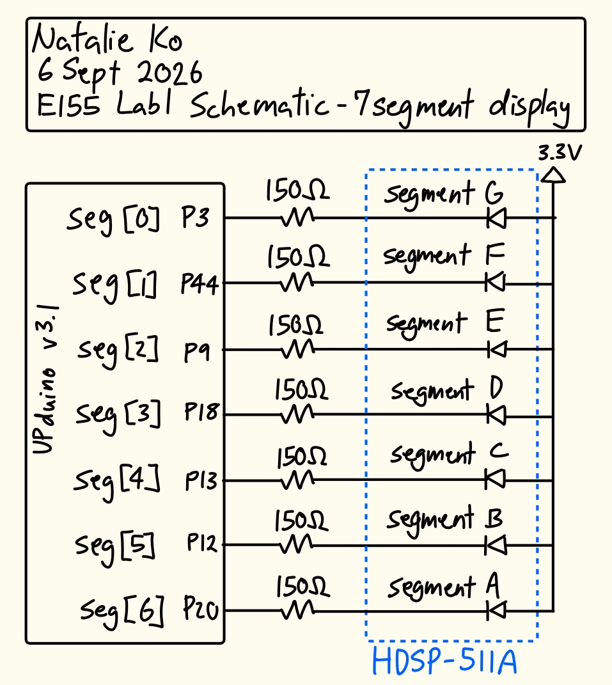

The block diagram in Figure 4 shows the physical circuit connections outside the PCB. The specified GPIO pins were connected to current-limiting resistors before the 7-segment display diodes. The common anode of the 7-segment display was connected to the 3.3V supply of the FPGA. 

## Results and Discussion
The design met all intended design objectives.

### Testbench Simulation
Figure 5 shows a screenshot of the QuestaSim simulation waveforms for my 7-segment submodule testbench. It behaved correctly because for each switch combination, the 7-segment output was correct (looking at both the individual waveforms and the output of my automatic testbench).

::: {.callout-note collapse="true"}
## Click to view 7-segment submodule simulation waveforms
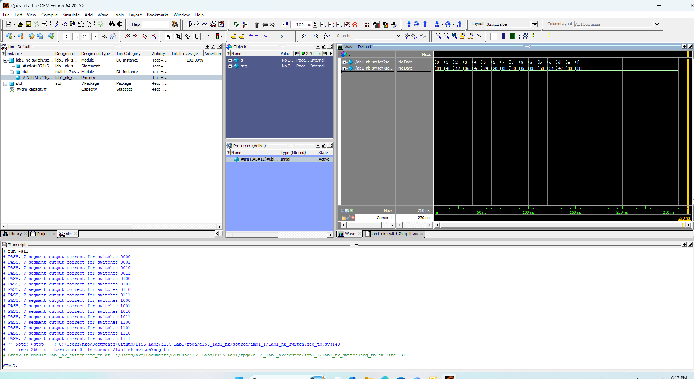
:::

::: {.callout-note collapse="true"}
## Click to view 7-segment submodule testbench outputs
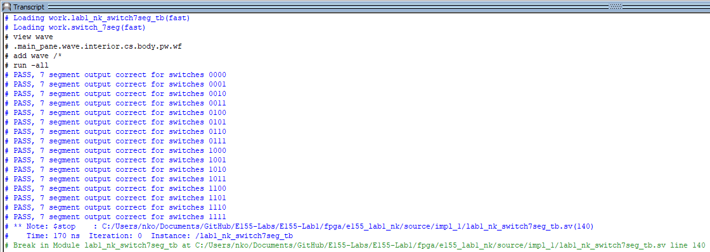
:::

Figure 7 shows a screenshot of the QuestaSim simulation waveforms for my counter submodule testbench. Note that since in my testbench I updated the MAX parameter to 10, so the clock signal conversion does not line up with 24MHz stepped down to 2.4Hz but instead 24MHz to 2.4MHz. The stepped-down output clock signal was high and low for the correct interval of time, even after a reset at an irregular time interval. When enable was pulled high, it functioned regularly as a counter (see first 2.5 clock signals), but when it was pulled low, the counter kept its currrent value of high until the reset was toggled again, resetting the counter to 0. This behaviour was also confirmed by my automatic testbench.

::: {.callout-note collapse="true"}
## Click to view counter submodule simulation waveforms
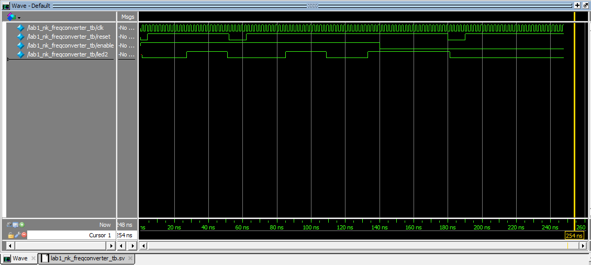
:::

::: {.callout-note collapse="true"}
## Click to view counter submodule testbench outputs
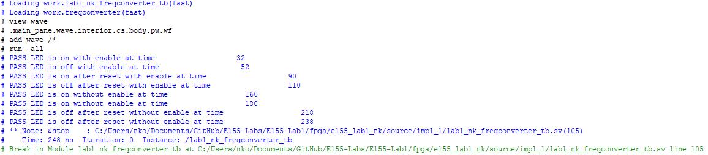
:::

Figure 9 shows a screenshot of the QuestaSim simulation waveforms for the clock generated by the HSOSC in the top-level module. The expected clock cycle was about 41.67ns (from the 24MHz generated), and the waveforms show the clock signal toggling every ~21ns, which is correct. This behaviour was also confirmed by my automatic testbench.

::: {.callout-note collapse="true"}
## Click to view top-level module clock simulation waveforms
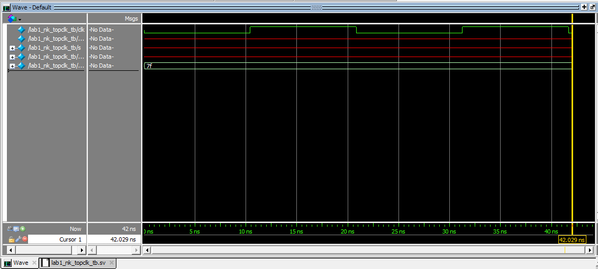
:::

::: {.callout-note collapse="true"}
## Click to view top-level module clock simulation outputs
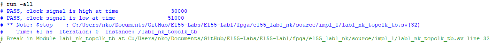
:::

Figure 11 shows a screenshot of the QuestaSim simulation waveforms for the combinational logic LED behaviour and 7-segment submodule connection at the top-level. It behaved correctly because for each switch combination, the LED and 7-segment output at the top-level were correct (looking at both the individual waveforms and the output of my automatic testbench).

::: {.callout-note collapse="true"}
## Click to view top-level module LED and 7-segment logic testbench simulation waveforms  
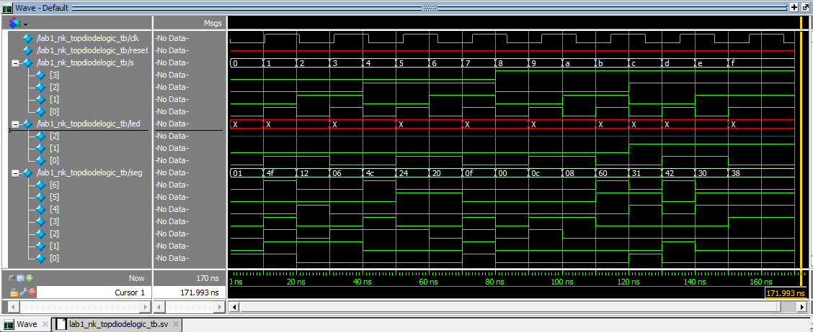
:::

::: {.callout-note collapse="true"}
## Click to view top-level module combinational logic simulation outputs
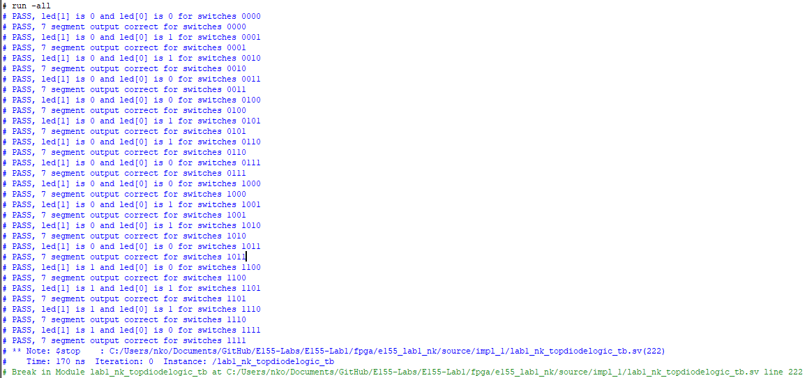
:::

Figure 13 shows a screenshot of the QuestaSim simulation waveforms testing the counter-submodule connection to the top-level. The top-level oscillating LED output was correctly read at half the 2.4Hz clock cycle twice and again after a reset was held to confirm the oscillation was 2.4Hz.

::: {.callout-note collapse="true"}
## Click to view top-level module freqconverter testbench simulation waveforms
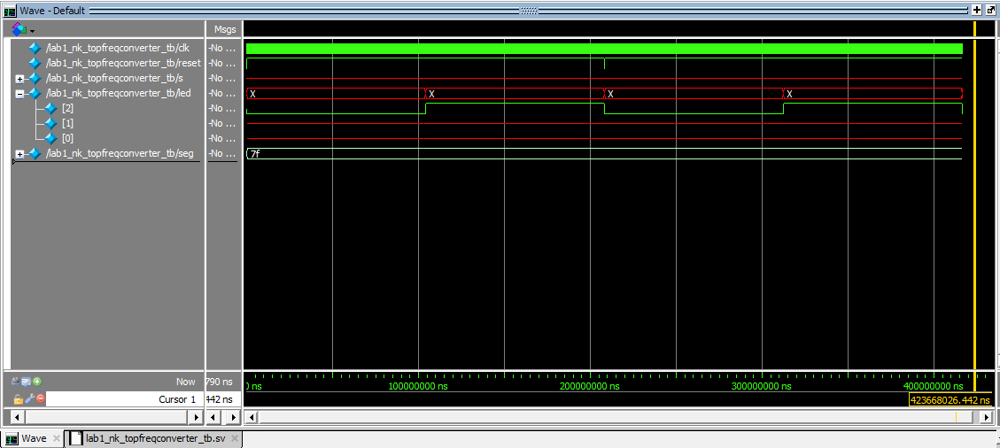
:::

::: {.callout-note collapse="true"}
## Click to view top-level module 2.4Hz simulation outputs
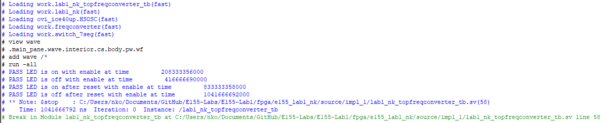
:::

### Hardware Deployment
This video showcases the design running on the completed PCB, with one on-board LED continuously blinking at 2.4Hz, and the other two on-board LEDs and the 7-segment display going through all 16 combinations of four switch inputs.



### Oscilloscope Testing
The 2.4Hz LED toggle was confirmed using an oscilloscope. When the oscilloscope was connected to the LED output pin and ground, the signal was observed as shown in Figure 5.

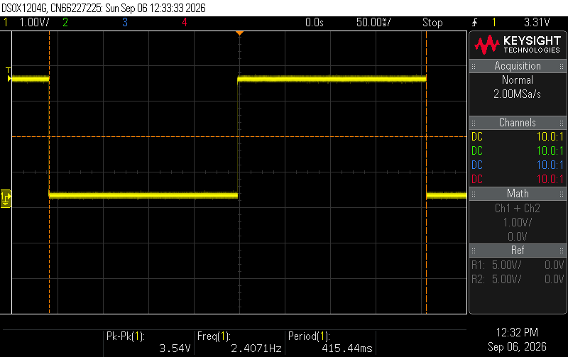

Using the internal oscilloscope frequency measurement tool, the frequency was measured to be ~2.407Hz, which is almost exactly the intended 2.4Hz frequency. The small discrepancy could be due to variations in the clock frequency provided by the HSOSC, oscilloscope measurement errors etc.

## Conclusion
The design successfully oscillated an on-board LED at 2.4Hz, and the 7-segment display and the two other on-board LEDs were successfully controlled by the four switch inputs. It worked both in all simulation testing and physical testing with the hardware.

I spent around 34 hours working on this lab (but some of the hours were trying to debug software issues with Lattice Radiant and QuestaSim).

## AI Prototype Summary
::: {.callout-note collapse="true"}
## Click to view the LLM-generated code
`// Target Device: Lattice iCE40UP5K (UltraPlus)
// Description: Drives an LED at 2 Hz using the internal 48 MHz HSOSC oscillator.

module top (
    output logic led
);

    // Internal signals
    logic clk_48mhz;
    
    // Counter parameters
    localparam int CLK_FREQ = 48_000_000;              // 48 MHz nominal oscillator
    localparam int TOGGLE_LIMIT = (CLK_FREQ / 4) - 1;   // 12,000,000 cycles (0.25s)
    
    // 24-bit counter variable
    logic [23:0] counter = '0;

    // Instantiate Lattice iCE40 UltraPlus HSOSC Primitive
    // CLKHF_DIV: "0b00" = 48 MHz, "0b01" = 24 MHz, "0b10" = 12 MHz, "0b11" = 6 MHz
    HSOSC #(
        .CLKHF_DIV("0b00")
    ) hsn_osc_inst (
        .CLKHFEN(1'b1),      // Enable high-speed oscillator
        .CLKHFPU(1'b1),      // Power up high-speed oscillator
        .CLKHF(clk_48mhz)    // High-speed clock output
    );

    // 2 Hz Toggle Logic
    always_ff @(posedge clk_48mhz) begin
        if (counter >= TOGGLE_LIMIT) begin
            counter <= '0;
            led     <= ~led;
        end else begin
            counter <= counter + 1'b1;
        end
    end

endmodule`
:::

I think the LLM-generated code was pretty good. It synthesized the first time without any issues, and Radiant didn't output any error messages. It outputted a warning message of "Port rejected for I/O register mapping: led", but I believe this is unrelated to the LLM-generated code. 

It's 2Hz toggle logic was almost the same as my counter module to step the 24MHz clock down to 2.4Hz, aside from missing the reset and enable inputs. I also think it made the code slightly more streamlined since in the else statement, it didn't bother making a wire from the previous led value to the current signal, and just included the counter increment. In my code, I had `led <= led` (with different variable names), which looking back I think is slightly unnecessary since the value will remain the same without this line, but when I wrote the code I thought it would prevent a possible latch.

I was surprised that the LLM didn't separate the toggle logic into a separate submodule. From E85, I'm used to programming these modules such that the top level only instantiates modules and does simple assign logic as needed. I assume the LLM only thinks of the current prompted tasks and not things like reusability of modules for future projects. I guess if someone is purely using the LLM to generate all code for separate individual tasks without doing any programming themselves this wouldn't be an issue as the LLM would just do everything from scratch each time, but I think this would make the overall workflow more inefficient and less readable.

Next time I use an LLM in my workflow I think I would add a line after the prompt that tells it to make and call submodules as it sees fit, and if someone in the future really doesn't want to go in and see what the submodules are about they can drop those individual files into the LLM as "given prewritten modules" that it can then call on in the future.