## Introduction
In this lab, the 7-segment and counter modules from the previous week were extended to control a dual 7-segment display and scan the columns of a 4x4 keypad. A design was implemented on the FPGA to exhibit these functions.

## Design and Testing Methodology
To design the dual 7-segment display and keypad scanning implementation, two submodules were created and linked by a top-level module. 

The first submodule called the counter module from lab 1 to step down a 24MHz HSOSC clock to a 120Hz clock. Based on the positive edge of the new clock signal, it would change which anode output (left vs right side) would be tied high, which determines which 7-segment side to write to. 120Hz was chosen because based on trial and error, this frequency allowed both segments to be perceived as on at the same time without any flickering or bleeding.

The second submodule called the counter module from lab 1 to step down a 24MHz HSOSC clock to a 1Hz clock. It then used assign statements to change each bit of the keypad row scanning output, so that only 1 bit out of 4 would be high at a time and they would oscillate at a rate of 2Hz.

The top-level module called on the two submodules and HSOSC. The anode output was connected as the select of a 2:1 mux, so that it's value determined which set of switches would be fed into the 7-segment submodule and the correct 7-segment pattern can be written. The column inputs were inverted and written to LEDs the LEDs blink at 2Hz when the corresponding row is scanned and column is pressed.

The design was tested using waveform simulation of the top-level module and the scanning submodule in QuestaSim through automatic testbenches to confirm the desired behaviour.

The scanning submodule testbench instantiated the submodule scan under a test. Reset and enable were pulled high. The row outputs were then checked every 0.006s as this is how long it should take for them to toggle. The reset was then pulled low and high and the row outputs were checked to reset to 4'b1000 and start rotating. Then, enable was set to low to confirm the row outputs would stop rotating, and reset was pulled high again to check the row outputs reset and did not continue changing.

The top-level submodule testbench instantiated the module lab_nk under a test. Reset was set high, switch inputs were set and the segments were checked after 8333334ns to confirm that the left/right segments were only written at the corresponding anode values. Then, different column inputs were written and the led outputs were checked to confirm the led bits were inverted column bits.

The dual 7-segment display circuit and keypad scanner circuit were built and connected separately to the FPGA GPIO pins because there were not enough pins to connect all the inputs and outputs at the same time. The design was tested by toggling all 8 switch inputs and observing the 7-segment display outputs, and then pressing keypad buttons individually and multiple in the same row/column and observing the LED outputs.

To implement this in hardware, PNP transistors need to be wired to the anodes of the dual 7-segment display becuase the required current is greater than what the FPGA GPIO pins can drive and NPN transistors need to be wired to the rows of the 4x4 keypad to prevent shorting multiple row drivers when multiple keys are pressed. The appropriate resistor values to go from the GPIO pins to the base of the transistors were calculated as shown in Figure 1 and Figure 2. Figure 1 also includes current-limiting resistor calculations for the diodes in the dual 7-segment display.

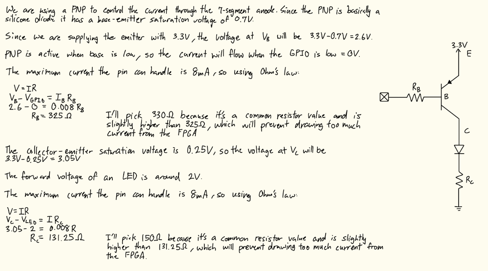

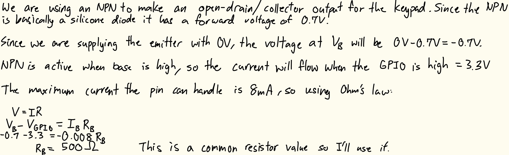

Figure 3 shows current-limiting resistor values for the keypad column-scanning LEDs.
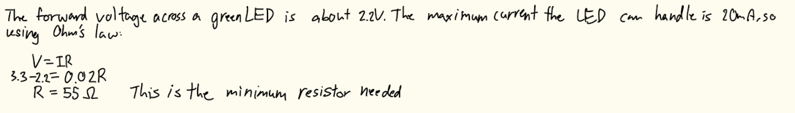

## Technical Documentation
The source code for the project can be found in the associated [GitHub repository](https://github.com/natalieko2024/E155-Labs/tree/main/E155-Lab2).

### Block Diagram
The block diagram in Figure 4 shows the overall architecture of the design. The top-level module lab2_nk includes four submodules: the high-speed oscillator (HSOSC), the multiplexing counter module (muxCounter), the 7-segment display module (switch_7seg), and the scanner module (scan). The top-level module also contains a MUX and a NOT gate to write the correct segments and LEDs.

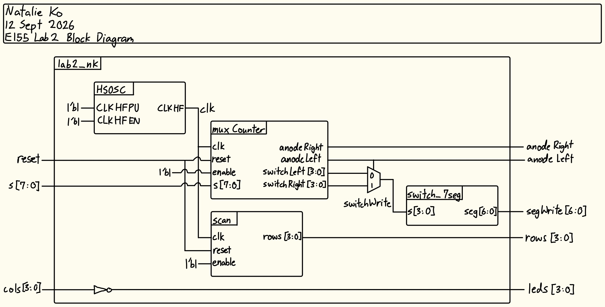

### Schematic
The schematic in Figure 5 shows the physical circuit connections outside the PCB for the dual 7-segment portion of the design. The specified GPIO pins were connected to current limiting resistors before the 7-segment display cathodes. The common anodes of the 7-segment display were connected to the 3.3V supply and GPIO pins of the FPGA through the 2N3906 transistors.

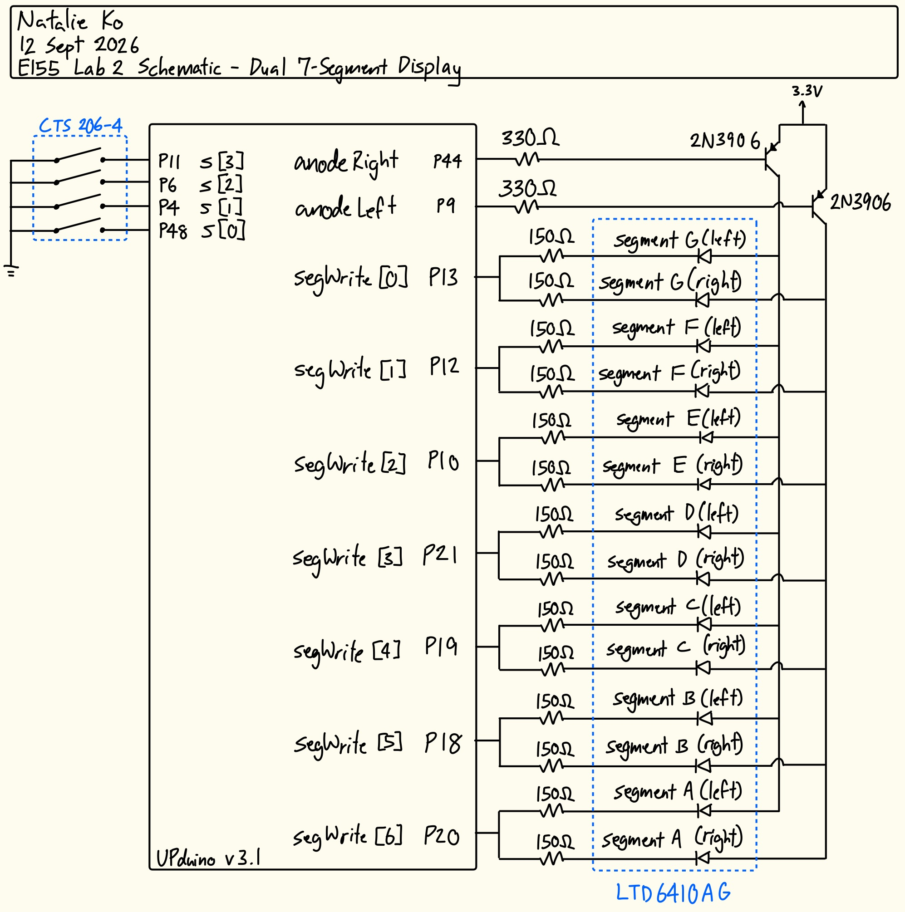

The schematic in Figure 6 shows the physical circuit connections outside the PCB for the keypad scanner portion of the design. The specified GPIO pins were connected to current limiting resistors and diodes for the LED outputs, and 2N3904 transistors connected to the 4x4 keypad to write rows. Pins were also connected to the keypad columns to collect as inputs.

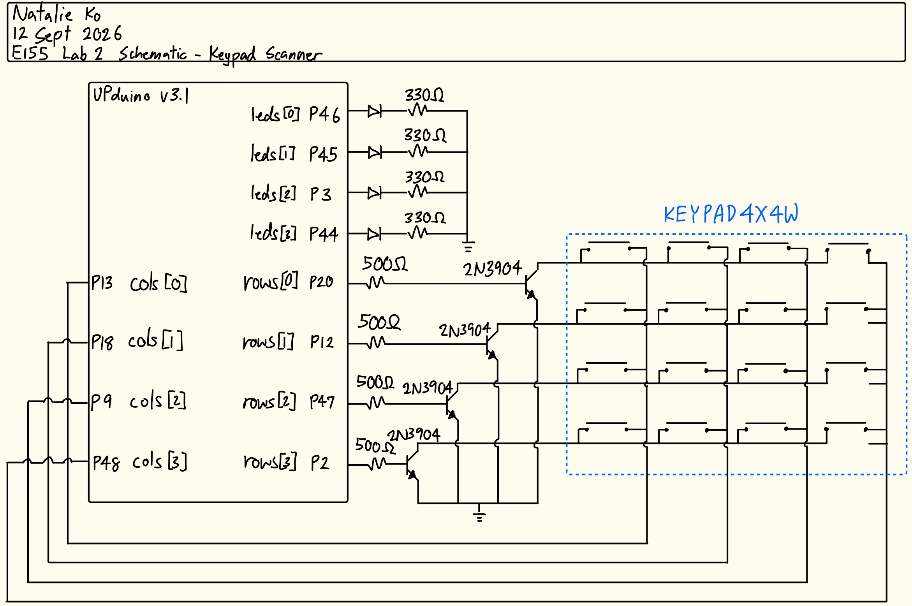

## Results and Discussion
The design met all intended design objectives.

### Testbench Simulation
Figure 7 shows a screenshot of the QuestaSim simulation waveforms for my scanning submodule testbench. It behaved correctly because after each 1/8 stepped-down clock cycle, the output rows were correct, including after a reset and after setting enable to low and then resetting again. This is also demonstrated by the automatic testbench outputs (see Figure 8).

:::{.callout-note collapse = "true"}
## Click to view scanning submodule simulation waveforms
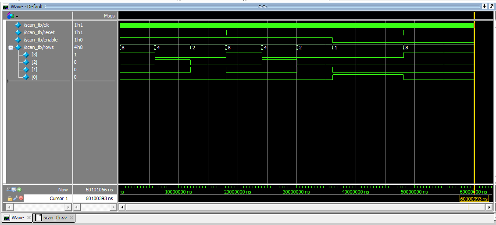
:::

:::{.callout-note collapse = "true"}
## Click to view scanning submodule testbench outputs
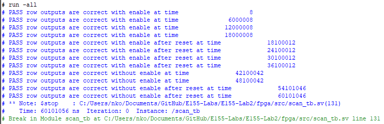
:::

Figure 9 shows a screenshot of the QuestaSim siimulation waveforms for my top module. It behaved correctly because after waiting for the anodes to invert, the segments were written correctly (demonstrating mux behaviour), and the LED outputs were always inverted signals compared to the column inputs. This is also demonstrated by the automatic testbench outputs (see Figure 10).

:::{.callout-note collapse = "true"}
## Click to view top-level module simulation waveforms
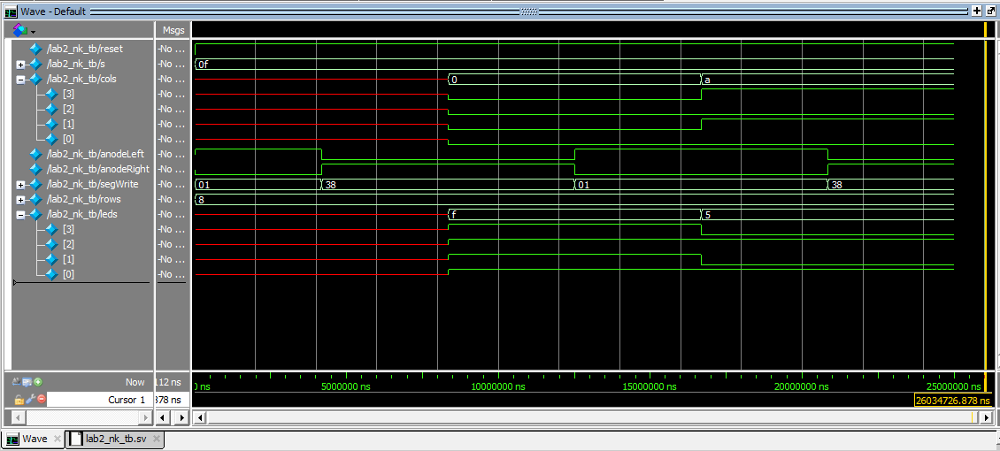
:::

:::{.callout-note collapse = "true"}
## Click to view top-level module testbench outputs
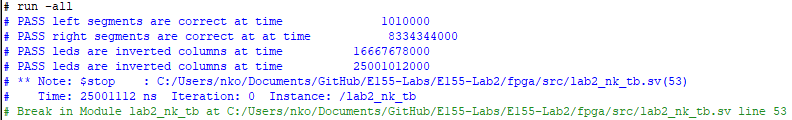
:::

### Hardware Deployment
These two videos showcases the design running on each circuit.



### Oscilloscope Testing
The keypad scanning LED frequency was confirmed using an oscilloscope. When the oscilloscope was connected on each end of the LED the signal was observed as in Figure 11.

::: {#fig-oscopeTraces layout-ncol=2}

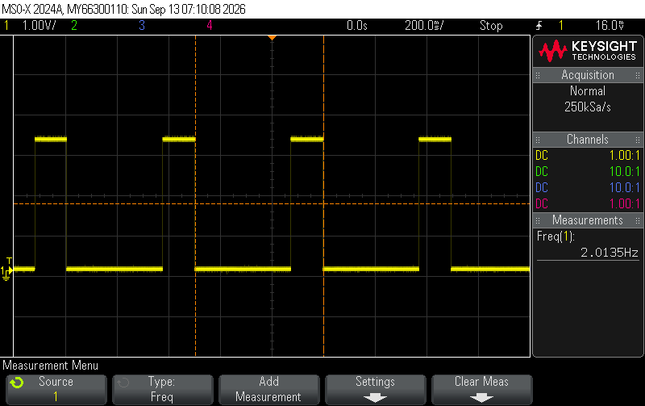

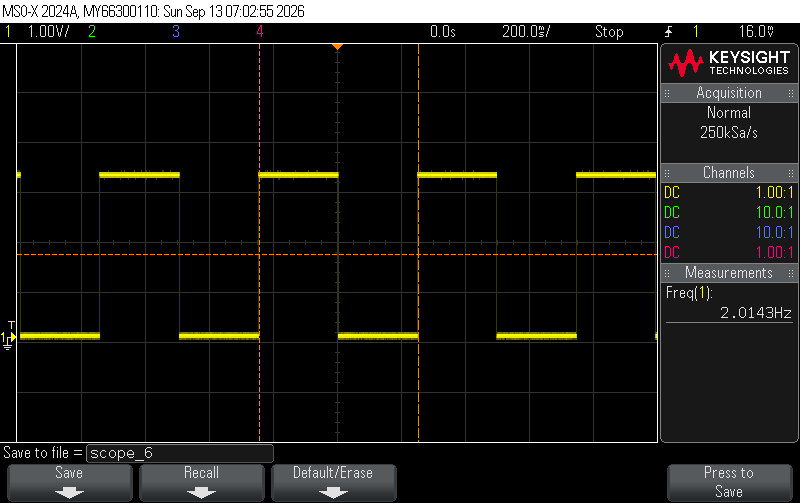

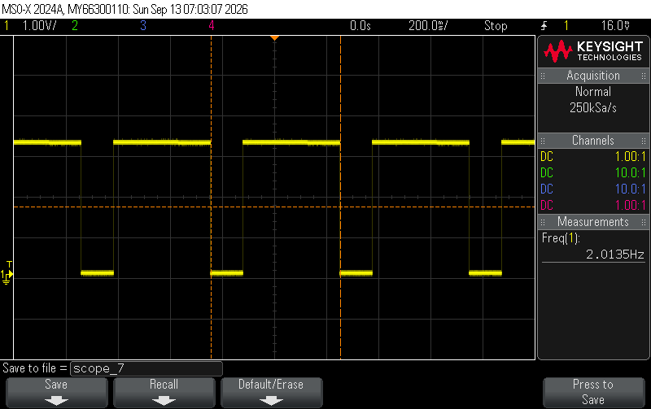

**Figure 11. Oscope Traces for LED Outputs**
:::

When the oscilloscope was connected to each row output, the signals were observed as in Figure 12.

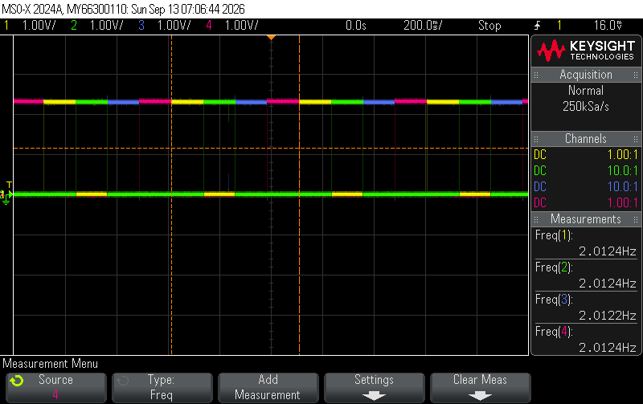

All signals oscillate at 2Hz as expected. For the LED outputs, the width of the high signal increases as more adjacent buttons are added, because the LED is on whenever the column is pressed and the row signal is on. As the row signal moves from row 1 to row 2 while the switch is still pressed, the column output will remain for the duration of both rows "ON"s.

## Conclusion
The design successfully drove a dual 7-segment display and scanned active keypad columns. It worked both in all simulation testing and physical testing with the hardware.

I spent about 20 hours working on this lab.

## AI Prototype Summary
::: {.callout-note collapse="true"}
## Click to view the LLM-generated code for prompt 1
```{systemverilog}
module top_display_multiplexer #(
    parameter integer CLK_FREQ_HZ = 50_000_000, // 50 MHz input clock
    parameter integer REFRESH_HZ  = 200          // Overall refresh frequency
)(
    input  logic       clk,
    input  logic       rst_n,      // Active-low asynchronous reset
    input  logic [3:0] in_digit0,  // First 4-bit nibble
    input  logic [3:0] in_digit1,  // Second 4-bit nibble
    output logic [6:0] seg,        // Seven segment outputs {g, f, e, d, c, b, a}
    output logic [1:0] anode       // Digit select lines (active-low)
);

    // Calculate clock divider threshold for multiplexing rate
    // Toggles every half-period of total refresh cycle
    localparam integer CNT_MAX = CLK_FREQ_HZ / (REFRESH_HZ * 2);

    logic [$clog2(CNT_MAX)-1:0] clk_cnt;
    logic                       digit_sel; // 0 = Digit 0, 1 = Digit 1
    logic [3:0]                 mux_nibble;

    // ------------------------------------------------------------------------
    // 1. Clock Divider / Mux Selector
    // ------------------------------------------------------------------------
    always_ff @(posedge clk or negedge rst_n) begin
        if (!rst_n) begin
            clk_cnt   <= '0;
            digit_sel <= 1'b0;
        end else if (clk_cnt == CNT_MAX - 1) begin
            clk_cnt   <= '0;
            digit_sel <= ~digit_sel; // Toggle active digit
        end else begin
            clk_cnt   <= clk_cnt + 1'b1;
        end
    end

    // ------------------------------------------------------------------------
    // 2. Data Multiplexer & Anode Controller (Active-Low)
    // ------------------------------------------------------------------------
    always_comb begin
        case (digit_sel)
            1'b0: begin
                mux_nibble = in_digit0;
                anode      = 2'b10; // Enable Digit 0 (active-low)
            end
            1'b1: begin
                mux_nibble = in_digit1;
                anode      = 2'b01; // Enable Digit 1 (active-low)
            end
            default: begin
                mux_nibble = 4'h0;
                anode      = 2'b11; // Turn off both
            end
        endcase
    end

    // ------------------------------------------------------------------------
    // 3. Shared Seven-Segment Decoder Instance
    // ------------------------------------------------------------------------
    sev_seg_decoder u_decoder (
        .nibble (mux_nibble),
        .seg    (seg)
    );

endmodule


// ----------------------------------------------------------------------------
// Common-Anode Seven Segment Decoder (Active-Low Output)
// Segments: {g, f, e, d, c, b, a}
// ----------------------------------------------------------------------------
module sev_seg_decoder (
    input  logic [3:0] nibble,
    output logic [6:0] seg
);

    always_comb begin
        case (nibble)
            4'h0: seg = 7'b100_0000; // 0
            4'h1: seg = 7'b111_1001; // 1
            4'h2: seg = 7'b010_0100; // 2
            4'h3: seg = 7'b011_0000; // 3
            4'h4: seg = 7'b001_1001; // 4
            4'h5: seg = 7'b010_0010; // 5
            4'h6: seg = 7'b010_0000; // 6
            4'h7: seg = 7'b111_1000; // 7
            4'h8: seg = 7'b000_0000; // 8
            4'h9: seg = 7'b001_0000; // 9
            4'hA: seg = 7'b000_1000; // A
            4'hB: seg = 7'b000_0011; // b
            4'hC: seg = 7'b100_0110; // C
            4'hD: seg = 7'b010_0001; // d
            4'hE: seg = 7'b000_0110; // E
            4'hF: seg = 7'b000_1110; // F
            default: seg = 7'b111_1111; // Blank
        endcase
    end

endmodule
```
:::

I think this LLM-generated code was pretty good, it synthesized the first time without any issues. I think its variable names could be improved on (what is "nibble" supposed to even mean???) and I didn't understand some of the lines such as `$clog2`. The code seems clean enough. It did choose an interesting way of defining a clock signal though, I didn't know using `localparam` was possible as an alternative to the HSOSC.

::: {.callout-note collapse="true"}
## Click to view the LLM-generated code for prompt 2
```{systemverilog}
// SystemVerilog module to time-multiplex a single seven-segment decoder
// across two 4-bit inputs using a single switch_7seg module and oscillator.

module display_multiplexer (
    input  logic       reset,
    input  logic [3:0] val0,
    input  logic [3:0] val1,
    output logic [6:0] seg0,
    output logic [6:0] seg1
);

    logic clk;
    logic select;
    logic [22:0] count;
    
    logic [3:0] current_val;
    logic [6:0] decoded_seg;

    // Instantiate high-speed oscillator (24MHz clock)[cite: 7]
    HSOSC #(.CLKHF_DIV("0b01")) hf_osc (
        .CLKHFPU(1'b1),
        .CLKHFEN(1'b1),
        .CLKHF(clk)
    );[cite: 7]

    // Instantiate frequency converter to toggle select bit[cite: 1]
    // Default MAX/WIDTH creates a standard multiplexing toggle frequency.
    freqconverter #(.WIDTH(23), .MAX(5000000)) freq_divider (
        .clk(clk),
        .reset(reset),
        .enable(1'b1),
        .led2(select),
        .counter(count)
    );[cite: 1]

    // Multiplexer selecting which input nibble goes to the decoder
    assign current_val = select ? val1 : val0;

    // Instantiate the single shared 7-segment decoder[cite: 8]
    switch_7seg decoder (
        .s(current_val),
        .seg(decoded_seg)
    );[cite: 8]

    // Demultiplex / Latch decoded 7-segment output values
    always_ff @(posedge clk) begin
        if (~reset) begin
            seg0 <= 7'b1111111; // All OFF (common anode)[cite: 8]
            seg1 <= 7'b1111111;
        end else begin
            if (select == 1'b0)
                seg0 <= decoded_seg;
            else
                seg1 <= decoded_seg;
        end
    end

endmodule
```
:::

This code was not so good. It didn't synthesize the first time, Radiant gave a syntax error in the module the LLM provided. Upon further inspection, the LLM shoved a bunch of `[cite:#]` blocks after each submodule instantiation. I assume these are "citations" to my provided modules. After removoing these, the code synthesized.