## Introduction
In this lab, a design was implemented on the FPGA to read a 4x4 matrix keypad input and display the last two hexadecimal digits on a dual seven-segment display with the most recent entry always appearing on the right. The design made it so each key press was recorded only once independent of the press length. If multiple keys were held at the same time, only the last key held would be displayed. 

## Design and Testing Methodology
This design was achieved using a finite state machine (see Figures 1 and 2), where the state would change depending on the collected key inputs. The variable keyMap is the current key inputs, while initialKeyMap is a snapshot of the key inputs during teh display state. In the display state, displayEN is set high, which allows writing to the 7 segment display through flip-flops in the top-level module.

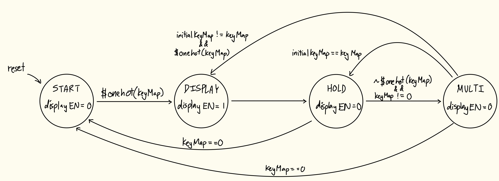

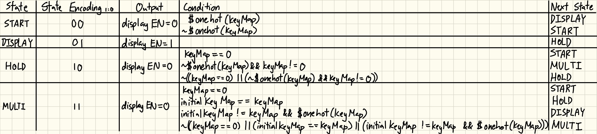

Like in the previous lab, key inputs were determined by "scanning" each row (sending a high bit to one row at a time) and collecting the column inputs. The column inputs were sent through a synchronizer to prevent reading metastable values. Besides the scan module, a keyMap module was developed to convert the corresponding row/column combination to a 16-bit key map.

The keypad switches were prone to switch bounce (the switch makes and breaks its connection repeatedly for up to ~10ms). To mitigate this issue and ensure each key was only registered once, a debouncer submodule was created, which used a shift register to compare the keymap at different intervals and only register the keys when all registers had the same value.

This debounced key map was an input to the FSM, a submodule converting the keys to equivalent switch inputs (which were sent into the 7-segment decoder from Lab 1).

The top level module wired all these submodules together, and had assign statements to compare counter values to provide the switching frequency for the 7-segment anodes, as well as a mux to determine which value to write to the left and right segments.

These modules were all tested using automatic testbenches, waveform simulation, and hardware deployment.

I think my debouncing strategy is more accurate and time efficient than other strategies. One other strategy I can think of is just waiting 10ms (maximum bouncing time) after the first button press before using the keyMap. However, this doesn't guarantee that after you wait, the button is actually debounced - it could slightly fluctuate, or if your count is off by a little bit you would read and use the bounce. Adding a strategy of storing the initial read and comparing at the end of the wait time to confirm debouncing could work. However, if another button happens to activate during the 10ms wait time, that button could still bounce after the first button is done, so they you would have to wait again. Using the shift register method means you don't have to have logic determining the first key press, or wait a specified amount of time. You always read until all registers log the same value.

However, the other strategies are probably more hardware efficient as I do use 9 flip-flops (probably could've used less, I was just being cautious), whereas the waiting strategy would just rely on a counter output that uses 1 flip-flop.

My design only includes 1 canonical FSM that evaluates the current debounced keyMap. I think another way to do achieve the end goal (with the alternative debouncing strategies described above) is to have a canonical FSM managing the display/scanning states communicate with another canonical FSM to control whether debouncing is active or not, or communicate with a non canonical FSM which is a counter to keep track of how long to wait for. However, I think this is more complicated and could make the overal FSM structure less reliable since switching or keeping states depend on more conditions that could be unexpected values right when the clock edge occurs, meaning you have to wait for the next cycle to actually transition correctly.

## Technical Documentation
The source code for the project can be found in the associated [GitHub repository](https://github.com/natalieko2024/E155-Labs/tree/main/E155-Lab3).

### Block Diagram
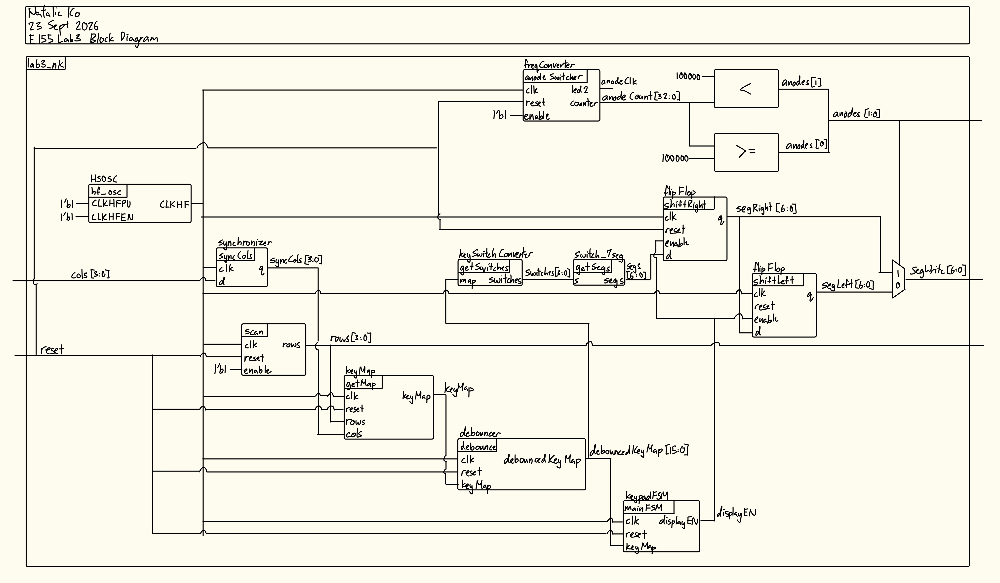
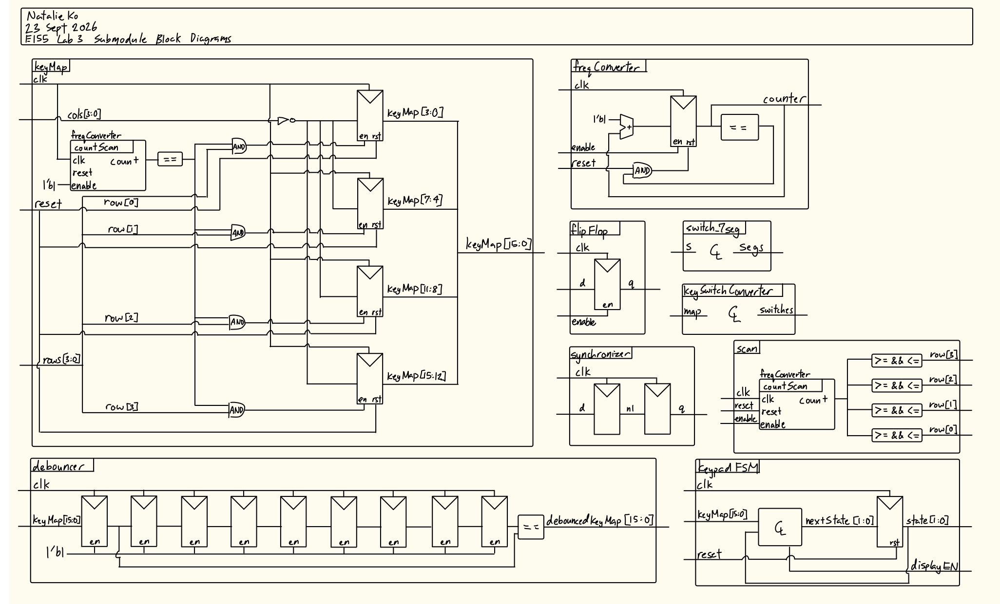

The block diagram in Figures 3 and 4shows the overall architecture of the design.

### Schematic
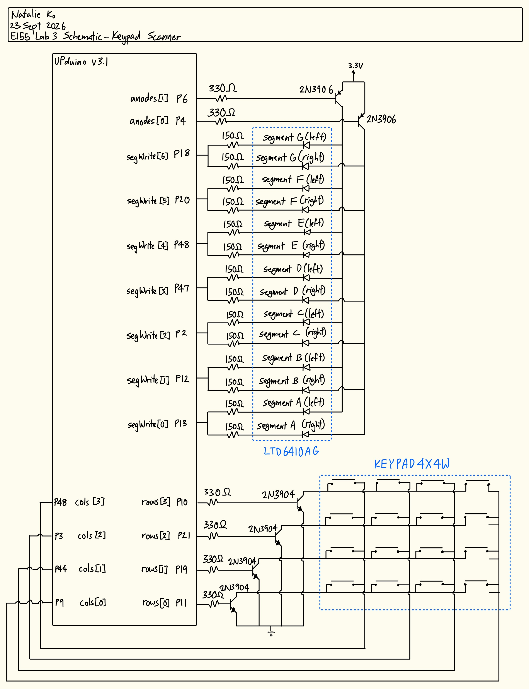

The schematic in Figure 5 shows the physical circuit connections outside the PCB. The only peripheral used on the PCB was the reset button.

## Results and Discussion
The design met all intended design objectives.

### Synthesizer Warnings
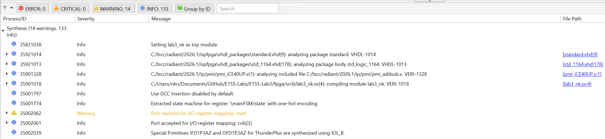

Radiant didn't give me any errors, warnings of latches or tristate buffers etc. The only warning I got was that my ports were rejected, but these do not affect deployment.

### Testbench Simulation
Figure 7 shows a screenshot of the QuestaSim simulation waveforms for my flip flop submodule. It behaved correctly because the output is always 1 clock rising edge behind the input when enabled. When disabled the output stops flowing, and when reset the output is set to 0. This was also confirmed by my automatic testbench (figure 8).

:::{.callout-note collapse="true"}
## Click to view flip flop submodule simulation waveforms
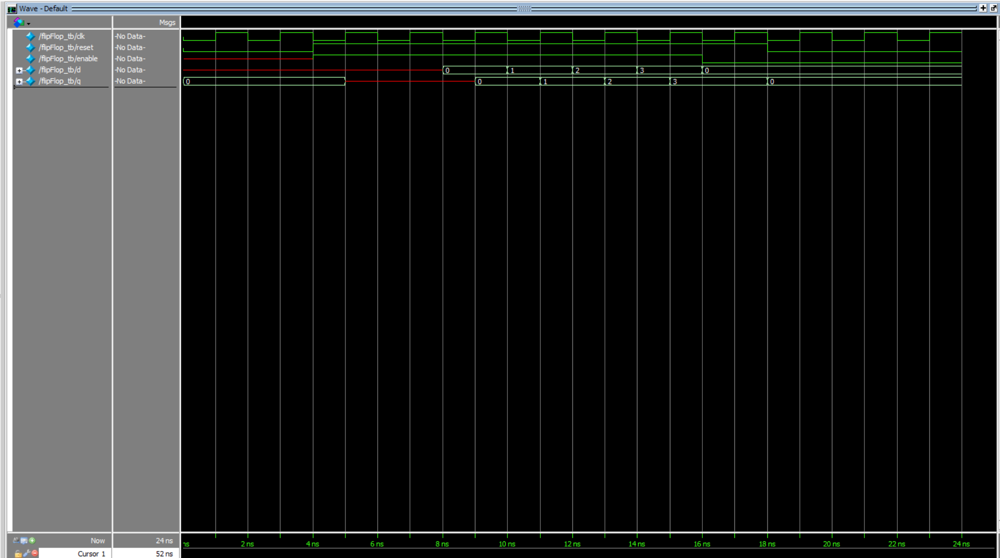
:::

:::{.callout-note collapse="true"}
## Click to view flip flop submodule testbench outputs
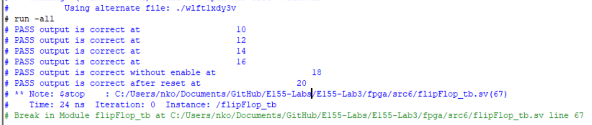
:::

Figure 9 shows a screenshot of the QuestaSim simulation waveforms for my synchronizer submodule. It behaved correctly because the output is always 2 clock rising edges behind the input. This was also confirmed by my automatic testbench (figure 10).

:::{.callout-note collapse="true"}
## Click to view synchronizer submodule simulation waveforms
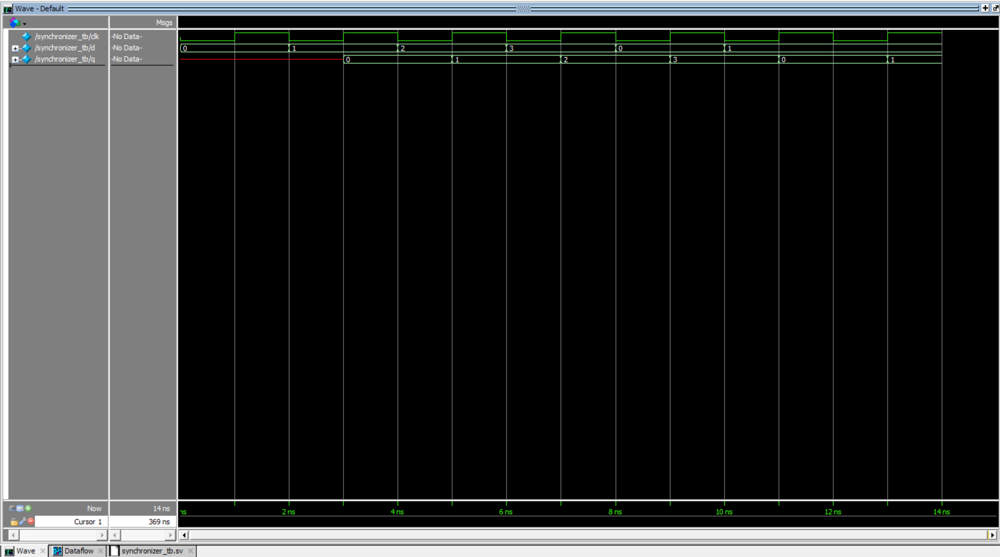
:::

:::{.callout-note collapse="true"}
## Click to view synchronizer submodule testbench outputs
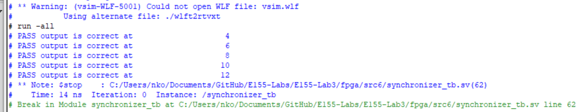
:::

The scanning submodule was retested because it was slightly modified so it could be parametrized instead of only having a fixed scanning frequency. As shown in Figure 11, after each 1/8 clock cycle, the output rows were correct, including after a reset and after setting enable to low and then resetting again. This is also demonstrated by the automatic testbench outputs (see Figure 12).

:::{.callout-note collapse="true"}
## Click to view scanning submodule simulation waveforms
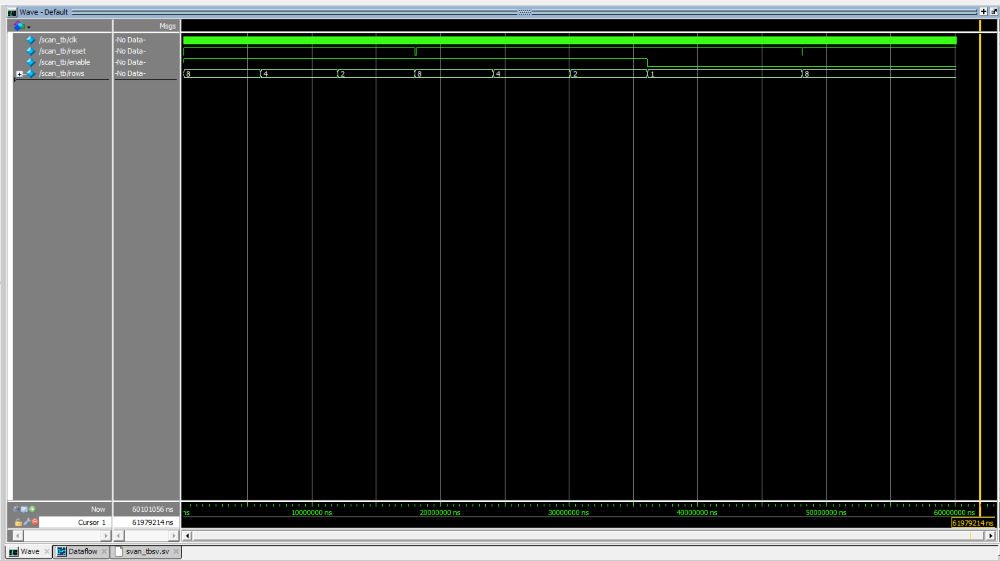
:::

:::{.callout-note collapse="true"}
## Click to view scanning submodule testbench outputs
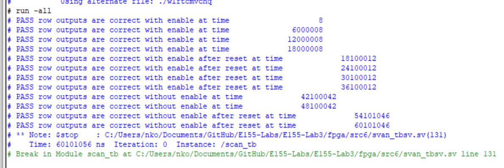
:::

Figure 13 shows a screenshot of the QuestaSim simulation waveforms for my keymap submodule. When each of the rows were high, the column inputs were mapped to the keymap correctly with both single presses and multi presses. When reset was enabled, the keymap reset to all 0s. This was also confirmed by my automatic testbench (figure 14).

:::{.callout-note collapse="true"}
## Click to view keymap submodule simulation waveforms
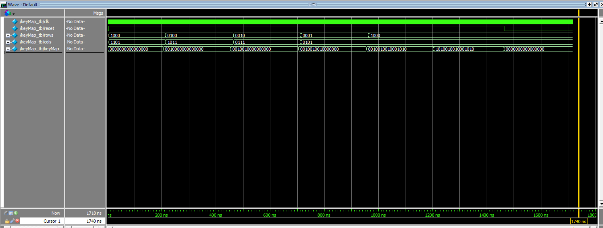
:::

:::{.callout-note collapse="true"}
## Click to view keymap submodule testbench outputs
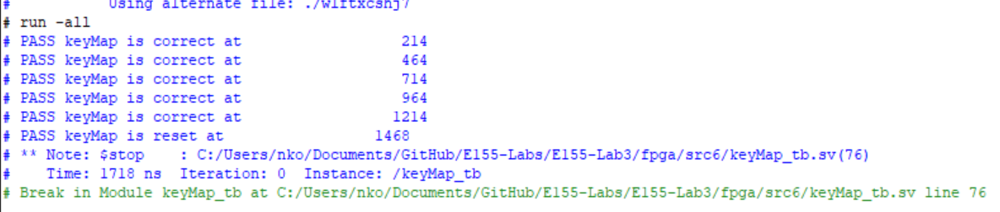
:::

Figure 15 shows the QuestaSim simulation waveforms for the debounce submodule. It behaved correctly because after oscillating the keymap bits repeatedly, the output was only changed value after the input was constant. After toggling the reset, the output would not change. This was also confirmed by the automatic testbench (figure 16).

:::{.callout-note collapse="true"}
## Click to view debounce submodule simulation waveforms
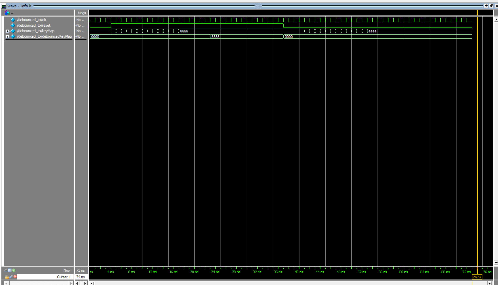
:::

:::{.callout-note collapse="true"}
## Click to view debounce submodule testbench outputs
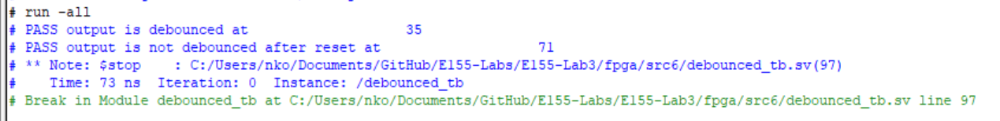
:::

Figure 17 shows the QuestaSim simulation waveforms for the FSM. All state transitions (including the reset) and outputs were tested to work. This was also confirmed by the automatic testbench (figure 18).

:::{.callout-note collapse="true"}
## Click to view FSM submodule simulation waveforms
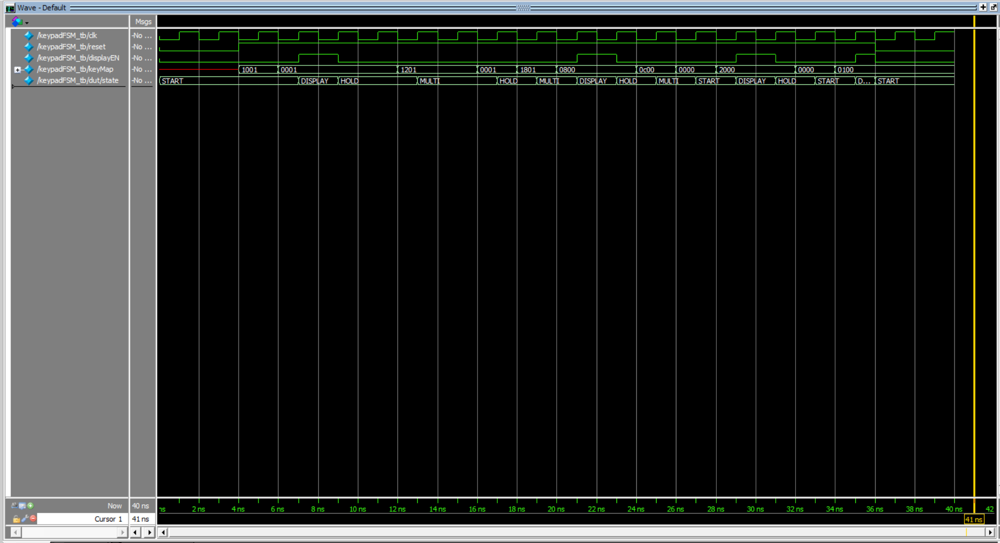
:::

:::{.callout-note collapse="true"}
## Click to view FSM submodule testbench outputs
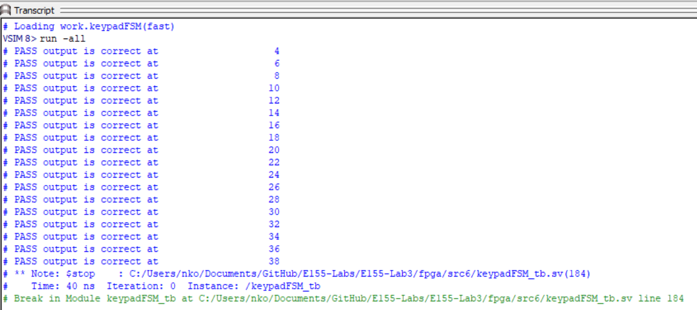
:::

Figures 19 and 20 show the QuestaSim simulation waveforms and testbench output for the keymap to switch input converter. Each keymap combination was converted to the correct switch combination.

:::{.callout-note collapse="true"}
## Click to view map to switch converter submodule simulation waveforms
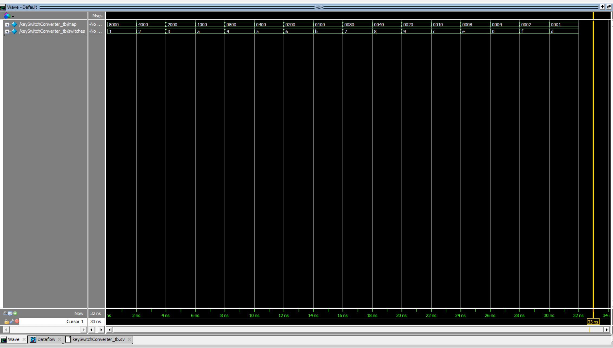
:::

:::{.callout-note collapse="true"}
## Click to view map to switch converter submodule testbench outputs
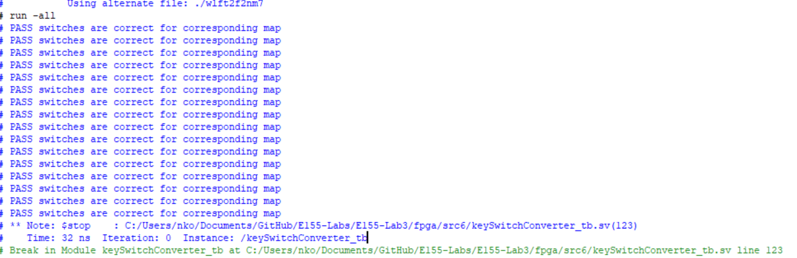
:::

Figures 21 and 22 show the QuestaSim simulation waveforms and testench output for the top level module. The column inputs were bounced for 10ms, then were held high, only when that particular row was high. The anodes changed at the right time, and the segment outputs matched the column inputs after they were held high. The segments were reset to 0 and the anode reset to 2'b10 when the reset was toggled.

:::{.callout-note collapse="true"}
## Click to view top level module simulation waveforms
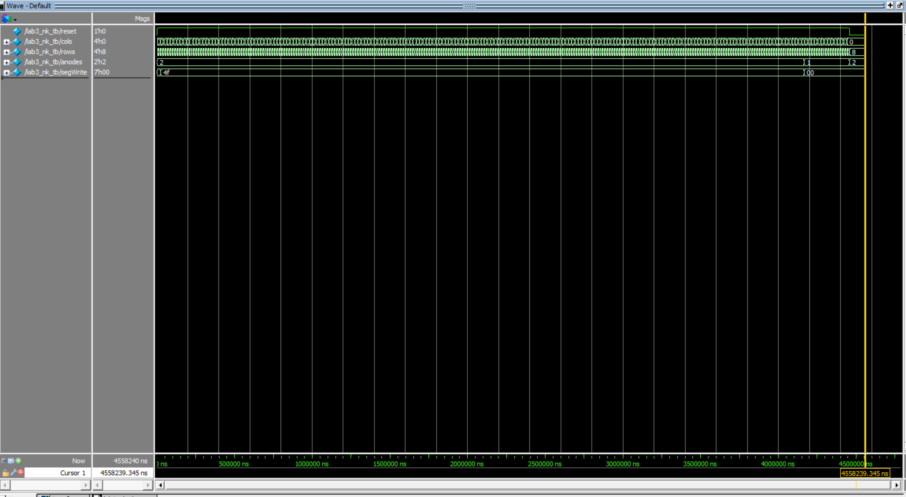
:::

:::{.callout-note collapse="true"}
## Click to view top level module testbench outputs
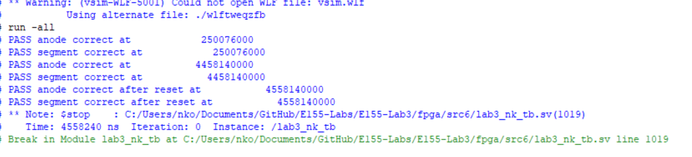
:::

### Hardware Deployment
Video showcasing the design running on hardware.


## Conclusion
The design successfully scanned a 4x4 matrix keypad and mapped the last two inputs to a dual 7-segment display, accounting for single and multi-key presses.

I spent over 86 hours on this lab. 

## AI Prototype Summary
::: {.callout-note collapse="true"}
## Click to view the LLM-generated code for monolithic prompt
```{systemverilog}
// File: clk_gen.sv
// Generates single-cycle enable pulses from the HFOSC master clock.
module clk_gen #(
    parameter int CLK_FREQ = 24_000_000, // 24 MHz HFOSC clock
    parameter int SCAN_HZ  = 200,        // 200 Hz scan clock (~5ms period)
    parameter int MUX_HZ   = 1000        // 1 kHz multiplexing clock (~1ms period)
)(
    input  logic clk,
    input  logic rst_n,
    output logic scan_tick,              // Pulse active for 1 cycle at SCAN_HZ
    output logic mux_tick                // Pulse active for 1 cycle at MUX_HZ
);

    localparam int SCAN_LIMIT = CLK_FREQ / SCAN_HZ;
    localparam int MUX_LIMIT  = CLK_FREQ / MUX_HZ;

    int count_scan;
    int count_mux;

    // Scan tick generator (~200 Hz)
    always_ff @(posedge clk or negedge rst_n) begin
        if (!rst_n) begin
            count_scan <= 0;
            scan_tick  <= 1'b0;
        end else begin
            if (count_scan >= SCAN_LIMIT - 1) begin
                count_scan <= 0;
                scan_tick  <= 1'b1;
            end else begin
                count_scan <= count_scan + 1;
                scan_tick  <= 1'b0;
            end
        end
    end

    // Display multiplexing tick generator (~1 kHz)
    always_ff @(posedge clk or negedge rst_n) begin
        if (!rst_n) begin
            count_mux <= 0;
            mux_tick  <= 1'b0;
        end else begin
            if (count_mux >= MUX_LIMIT - 1) begin
                count_mux <= 0;
                mux_tick  <= 1'b1;
            end else begin
                count_mux <= count_mux + 1;
                mux_tick  <= 1'b0;
            end
        end
    end

endmodule

// File: keypad_scanner.sv
// Scans a 4x4 active-low keypad and emits a single-cycle valid pulse per press.
module keypad_scanner (
    input  logic       clk,
    input  logic       rst_n,
    input  logic       scan_tick,   // ~200 Hz pulse
    input  logic [3:0] rows,        // Active-low inputs from keypad
    output logic [3:0] cols,        // Active-low driven column outputs
    output logic [3:0] key_code,    // Decoded 4-bit Hex Value (0x0 - 0xF)
    output logic       key_valid    // 1-cycle pulse when key is registered
);

    typedef enum logic [1:0] {
        SCAN,       // Continuously scan columns
        REGISTER,   // Capture valid key code (1 cycle pulse)
        WAIT_RELEASE// Hold state until all keys are released
    } state_t;

    state_t state;

    logic [1:0] col_idx;
    logic [3:0] active_rows;
    logic [3:0] detected_key;
    logic       key_pressed;

    // Active-low column pattern: only one column is driven LOW at a time
    assign cols = ~(4'b0001 << col_idx);

    // Synchronize and invert rows (1 = pressed)
    assign active_rows = ~rows;

    // Determine if any key in the active column is pressed
    assign key_pressed = (active_rows != 4'b0000);

    // Row decoder logic
    always_comb begin
        case (active_rows)
            4'b0001: detected_key = {col_idx, 2'b00}; // Row 0 -> Hex offset 0
            4'b0010: detected_key = {col_idx, 2'b01}; // Row 1 -> Hex offset 1
            4'b0100: detected_key = {col_idx, 2'b10}; // Row 2 -> Hex offset 2
            4'b1000: detected_key = {col_idx, 2'b11}; // Row 3 -> Hex offset 3
            default: detected_key = 4'h0;             // Handle multi-key/invalid
        endcase
    end

    // FSM and Column Stepping Logic
    always_ff @(posedge clk or negedge rst_n) begin
        if (!rst_n) begin
            state     <= SCAN;
            col_idx   <= '0;
            key_code  <= '0;
            key_valid <= 1'b0;
        end else begin
            key_valid <= 1'b0; // Default pulse low

            if (scan_tick) begin
                case (state)
                    SCAN: begin
                        if (key_pressed) begin
                            key_code  <= detected_key;
                            key_valid <= 1'b1;
                            state     <= WAIT_RELEASE;
                        end else begin
                            col_idx <= col_idx + 1'b1; // Advance to next column
                        end
                    end

                    WAIT_RELEASE: begin
                        // Wait until all columns read zero active rows
                        if (!key_pressed) begin
                            col_idx <= col_idx + 1'b1;
                            // Check if we completed a full 4-col scan with no keys down
                            if (col_idx == 2'b11) begin
                                state <= SCAN;
                            end
                        end else begin
                            // Reset full release check if a key is still detected
                            col_idx <= col_idx + 1'b1;
                        end
                    end

                    default: state <= SCAN;
                endcase
            end
        end
    end

endmodule

// File: seven_seg_mux.sv
// Time-multiplexed driver for a dual 7-segment display (Common Anode).
module seven_seg_mux (
    input  logic       clk,
    input  logic       rst_n,
    input  logic       mux_tick,     // ~1 kHz refresh pulse
    input  logic [3:0] digit_high,   // Older hex digit (Left)
    input  logic [3:0] digit_low,    // Newest hex digit (Right)
    output logic [1:0] digit_sel,    // Active-low digit anode selects
    output logic [6:0] seg           // Active-low segments [a,b,c,d,e,f,g]
);

    logic       active_digit;
    logic [3:0] current_nibble;

    // Toggle active digit at 1 kHz
    always_ff @(posedge clk or negedge rst_n) begin
        if (!rst_n) begin
            active_digit <= 1'b0;
        end else if (mux_tick) begin
            active_digit <= ~active_digit;
        end
    end

    // Select active nibble and digit strobe line
    always_comb begin
        if (active_digit == 1'b0) begin
            digit_sel      = 2'b10; // Enable Digit 0 (Right / Most recent)
            current_nibble = digit_low;
        end else begin
            digit_sel      = 2'b01; // Enable Digit 1 (Left / Older)
            current_nibble = digit_high;
        end
    end

    // Hex to 7-Segment Decoder (Active-LOW outputs: 0 = LED On)
    // Map order: [a, b, c, d, e, f, g]
    always_comb begin
        case (current_nibble)
            4'h0: seg = 7'b000_0001;
            4'h1: seg = 7'b100_1111;
            4'h2: seg = 7'b001_0010;
            4'h3: seg = 7'b000_0110;
            4'h4: seg = 7'b100_1100;
            4'h5: seg = 7'b010_0100;
            4'h6: seg = 7'b010_0000;
            4'h7: seg = 7'b000_1111;
            4'h8: seg = 7'b000_0000;
            4'h9: seg = 7'b000_0100;
            4'hA: seg = 7'b000_1000;
            4'hB: seg = 7'b110_0000;
            4'hC: seg = 7'b011_0001;
            4'hD: seg = 7'b100_0010;
            4'hE: seg = 7'b011_0000;
            4'hF: seg = 7'b011_1000;
            default: seg = 7'b111_1111; // Blank
        endcase
    end

endmodule

// File: top.sv
// Top-level module for Lattice iCE40 UP5K
module top (
    input  logic       ext_rst_n, // External active-low reset button
    input  logic [3:0] kp_rows,   // Keypad row inputs
    output logic [3:0] kp_cols,   // Keypad column outputs
    output logic [1:0] digit_sel, // Display digit selector (Active-low anode)
    output logic [6:0] seg        // Display segment driver (Active-low cathodic)
);

    // Internal High-Speed Oscillator Signal
    logic clk;

    // Instantiate Lattice iCE40 Primitive Oscillator
    // CLKF = 2'b00 configures output frequency to ~24 MHz
    SB_HFOSC #(
        .CLKHF_DIV("0b01") // 24 MHz output setting
    ) hf_osc_inst (
        .CLKHFPU(1'b1),    // Power-up oscillator
        .CLKHFEN(1'b1),    // Enable clock output
        .CLKHF  (clk)      // Output clock net
    );

    // Control and Data Signals
    logic scan_tick;
    logic mux_tick;
    logic [3:0] new_key;
    logic       key_valid;

    // Shift Register for Key History
    logic [3:0] key_digit_recent;
    logic [3:0] key_digit_older;

    // Clock and Timing Generator
    clk_gen #(
        .CLK_FREQ(24_000_000),
        .SCAN_HZ(200),
        .MUX_HZ(1000)
    ) u_clk_gen (
        .clk       (clk),
        .rst_n     (ext_rst_n),
        .scan_tick (scan_tick),
        .mux_tick  (mux_tick)
    );

    // Matrix Keypad Controller
    keypad_scanner u_keypad (
        .clk       (clk),
        .rst_n     (ext_rst_n),
        .scan_tick (scan_tick),
        .rows      (kp_rows),
        .cols      (kp_cols),
        .key_code  (new_key),
        .key_valid (key_valid)
    );

    // Shift memory: Update history upon valid key registration
    always_ff @(posedge clk or negedge ext_rst_n) begin
        if (!ext_rst_n) begin
            key_digit_recent <= 4'h0;
            key_digit_older  <= 4'h0;
        end else if (key_valid) begin
            key_digit_older  <= key_digit_recent;
            key_digit_recent <= new_key;
        end
    end

    // Dual 7-Segment Display Driver
    seven_seg_mux u_display (
        .clk        (clk),
        .rst_n      (ext_rst_n),
        .mux_tick   (mux_tick),
        .digit_high (key_digit_older),
        .digit_low  (key_digit_recent),
        .digit_sel  (digit_sel),
        .seg        (seg)
    );

endmodule
```

:::

When I synthesized this code in Radiant, I got the error `Instantiating unknown module SB_HFOSC`, and the LLM was really against changing this. After I kept insisting it didn't work, it finally changed it to the HSOSC we used. However, it kept thinking `1'b1` was instead `1'me` and refused to change this. Additionally, Radiant said the register driving the keypad was stuck at 0, and the LLM didn't think anything was wrong, so it wouldn't change anything. 

::: {.callout-note collapse="true"}
## Click to view the LLM-generated code for modularic prompt
```{systemverilog}
// Target Device: Lattice iCE40 UP5K FPGA
// Function: 4x4 Keypad Scanner, Debouncer, and One-Shot Key Registration FSM

module keypad_one_shot #(
    parameter int CLK_FREQ_HZ   = 12_000_000, // Default SB_HFOSC / 4 (~12 MHz)
    parameter int DEBOUNCE_MS   = 10          // Debounce delay per scan step (~10 ms)
)(
    input  logic       clk,            // System clock
    input  logic       rst_n,          // Active-low asynchronous reset
    input  logic [3:0] col_pad,        // Inputs from Keypad Columns (active-low with pull-ups)
    output logic [3:0] row_pad,        // Outputs to Keypad Rows (driven low sequentially)
    output logic [3:0] key_code,       // Registered 4-bit hex value (0x0 - 0xF)
    output logic       new_key_valid   // 1-cycle strobe when a new key is captured
);

    // =========================================================================
    // 1. Clock Divider / Tick Generator for Debounce & Scan Speed
    // =========================================================================
    localparam int TICK_COUNT_MAX = (CLK_FREQ_HZ / 1000) * DEBOUNCE_MS;
    localparam int TICK_CNT_WIDTH = $clog2(TICK_COUNT_MAX);

    logic [TICK_CNT_WIDTH-1:0] tick_cnt;
    logic                      scan_tick;

    always_ff @(posedge clk or negedge rst_n) begin
        if (!rst_n) begin
            tick_cnt  <= '0;
            scan_tick <= 1'b0;
        end else begin
            scan_tick <= 1'b0;
            if (tick_cnt >= TICK_COUNT_MAX - 1) begin
                tick_cnt  <= '0;
                scan_tick <= 1'b1;
            end else begin
                tick_cnt  <= tick_cnt + 1'b1;
            end
        end
    end

    // =========================================================================
    // 2. Row Scanning Logic (Active-Low Driving)
    // =========================================================================
    logic [1:0] row_idx;
    
    // Convert 2-bit counter into active-low 1-of-4 row drive pattern
    assign row_pad = ~(4'b0001 << row_idx);

    // =========================================================================
    // 3. Column Key Code Decoding
    // =========================================================================
    logic       col_active;
    logic [1:0] col_idx;

    // Detect if any key in the current scanned row is pressed (col input is LOW)
    always_comb begin
        case (col_pad)
            4'b1110: begin col_active = 1'b1; col_idx = 2'd0; end
            4'b1101: begin col_active = 1'b1; col_idx = 2'd1; end
            4'b1011: begin col_active = 1 me1; col_idx = 2'd2; end // 4'b1011
            4'b0111: begin col_active = 1'b1; col_idx = 2'd3; end
            default: begin col_active = 1'b0; col_idx = 2'd0; end
        endcase
    end

    // Hex Lookup Table mapping Matrix Position {Row, Col} to standard Hex Keypad values
    // [R0 C0..C3] -> 1, 2, 3, A
    // [R1 C0..C3] -> 4, 5, 6, B
    // [R2 C0..C3] -> 7, 8, 9, C
    // [R3 C0..C3] -> 0, F, E, D
    logic [3:0] decoded_key;
    always_comb begin
        case ({row_idx, col_idx})
            4'h0: decoded_key = 4'h1;
            4'h1: decoded_key = 4'h2;
            4'h2: decoded_key = 4'h3;
            4'h3: decoded_key = 4'hA;
            
            4'h4: decoded_key = 4'h4;
            4'h5: decoded_key = 4'h5;
            4'h6: decoded_key = 4'h6;
            4'h7: decoded_key = 4'hB;
            
            4'h8: decoded_key = 4'h7;
            4'h9: decoded_key = 4'h8;
            4'hA: decoded_key = 4'h9;
            4'hB: decoded_key = 4'hC;
            
            4'hC: decoded_key = 4'h0;
            4'hD: decoded_key = 4'hF;
            4'hE: decoded_key = 4'hE;
            4'hF: decoded_key = 4'hD;
        endcase
    end

    // =========================================================================
    // 4. One-Shot Debounce and Key-Lockout FSM
    // =========================================================================
    typedef enum logic [1:0] {
        ST_IDLE         = 2'b00,
        ST_DEBOUNCE     = 2'b01,
        ST_CAPTURE      = 2'b11,
        ST_WAIT_RELEASE = 2'b10
    } state_e;

    state_e state;
    logic [1:0] captured_row;
    logic [1:0] captured_col;

    always_ff @(posedge clk or negedge rst_n) begin
        if (!rst_n) begin
            state         <= ST_IDLE;
            row_idx       <= '0;
            key_code      <= '0;
            new_key_valid <= 1'b0;
            captured_row  <= '0;
            captured_col  <= '0;
        end else begin
            // Default output strobe clear
            new_key_valid <= 1'b0;

            if (scan_tick) begin
                case (state)
                    // Continuous scanning state until a key press is detected
                    ST_IDLE: begin
                        if (col_active) begin
                            captured_row <= row_idx;
                            captured_col <= col_idx;
                            state        <= ST_DEBOUNCE;
                        end else begin
                            row_idx <= row_idx + 1'b1;
                        end
                    end

                    // Wait 1 scan tick period to verify stability
                    ST_DEBOUNCE: begin
                        // Check if the same key position is still active
                        if (col_active && (row_idx == captured_row) && (col_idx == captured_col)) begin
                            state <= ST_CAPTURE;
                        end else begin
                            // False trigger / bounce, return to scan
                            row_idx <= row_idx + 1'b1;
                            state   <= ST_IDLE;
                        end
                    end

                    // Assert single-cycle strobe output and save key code
                    ST_CAPTURE: begin
                        key_code      <= decoded_key;
                        new_key_valid <= 1'b1; // Glitch-free registered output
                        state         <= ST_WAIT_RELEASE;
                    end

                    // Multi-key lockout: Keep scanning rows, but refuse new input until ALL keys released
                    ST_WAIT_RELEASE: begin
                        row_idx <= row_idx + 1'b1;
                        if (!col_active) begin
                            // Check if a full scanning cycle across all 4 rows shows no active keys
                            if (row_idx == 2'd3) begin
                                state <= ST_IDLE;
                            end
                        end
                    end

                    default: state <= ST_IDLE;
                endcase
            end
        end
    end

endmodule

// Target Device: Lattice iCE40 UP5K FPGA
// Function: 4x4 Keypad Scanner and Row Sampler with Active-Low I/O

module keypad_scanner #(
    parameter int CLK_FREQ_HZ  = 12_000_000, // Default system clock frequency (12 MHz)
    parameter int SCAN_FREQ_HZ = 1_000       // Scan step frequency (1 kHz -> 1 ms per column)
)(
    input  logic       clk,           // System clock
    input  logic       rst_n,         // Active-low asynchronous reset
    input  logic [3:0] row_pad,       // Rows from Keypad (Inputs, Active-Low with Pull-ups)
    output logic [3:0] col_pad,       // Columns to Keypad (Outputs, Driven Active-Low)
    output logic [3:0] key_code,      // Decoded Hex Key Value (0x0 - 0xF)
    output logic       key_pressed    // High whenever a key is currently held down
);

    // =========================================================================
    // 1. Clock Divider for Column Scanning
    // =========================================================================
    localparam int CLK_DIV_MAX = CLK_FREQ_HZ / SCAN_FREQ_HZ;
    localparam int CLK_DIV_W   = $clog2(CLK_DIV_MAX);

    logic [CLK_DIV_W-1:0] clk_cnt;
    logic                 scan_tick;

    always_ff @(posedge clk or negedge rst_n) begin
        if (!rst_n) begin
            clk_cnt   <= '0;
            scan_tick <= 1'b0;
        end else begin
            scan_tick <= 1'b0;
            if (clk_cnt >= CLK_DIV_MAX - 1) begin
                clk_cnt   <= '0;
                scan_tick <= 1'b1;
            end else begin
                clk_cnt   <= clk_cnt + 1'b1;
            end
        end
    end

    // =========================================================================
    // 2. Input Synchronizer for Row Pads (Metastability Protection)
    // =========================================================================
    logic [3:0] row_sync_0, row_sync_1;

    always_ff @(posedge clk or negedge rst_n) begin
        if (!rst_n) begin
            row_sync_0 <= 4'b1111;
            row_sync_1 <= 4'b1111;
        end else begin
            row_sync_0 <= row_pad;
            row_sync_1 <= row_sync_0;
        end
    end

    // =========================================================================
    // 3. FSM State Definition & Keypad Scan Logic
    // =========================================================================
    typedef enum logic [1:0] {
        COL_0 = 2'd0,
        COL_1 = 2'd1,
        COL_2 = 2'd2,
        COL_3 = 2'd3
    } scan_state_e;

    scan_state_e col_state;

    // Active-Low Column Drive Pattern
    always_comb begin
        case (col_state)
            COL_0:   col_pad = 4'b1110;
            COL_1:   col_pad = 4'b1101;
            COL_2:   col_pad = 4'b1011;
            COL_3:   col_pad = 4'b0111;
            default: col_pad = 4'b1111;
        endcase
    end

    // Active-Low Row Detection
    logic       row_active;
    logic [1:0] active_row_idx;

    always_comb begin
        case (row_sync_1)
            4'b1110: begin row_active = 1'b1; active_row_idx = 2'd0; end
            4'b1101: begin row_active = 1'b1; active_row_idx = 2'd1; end
            4'b1011: begin row_active = 1'b1; active_row_idx = 2'd2; end
            4'b0111: begin row_active = 1'b1; active_row_idx = 2'd3; end
            default: begin row_active = 1'b0; active_row_idx = 2'd0; end
        endcase
    end

    // Standard 4x4 Keypad Decoding
    // [Row 0]: 1, 2, 3, A
    // [Row 1]: 4, 5, 6, B
    // [Row 2]: 7, 8, 9, C
    // [Row 3]: 0, F, E, D
    logic [3:0] decoded_hex;

    always_comb begin
        case ({active_row_idx, col_state})
            4'h0: decoded_hex = 4'h1;
            4'h1: decoded_hex = 4'h2;
            4'h2: decoded_hex = 4'h3;
            4'h3: decoded_hex = 4'hA;

            4'h4: decoded_hex = 4'h4;
            4'h5: decoded_hex = 4'h5;
            4'h6: decoded_hex = 4'h6;
            4'h7: decoded_hex = 4'hB;

            4'h8: decoded_hex = 4'h7;
            4'h9: decoded_hex = 4'h8;
            4'hA: decoded_hex = 4'h9;
            4'hB: decoded_hex = 4'hC;

            4'hC: decoded_hex = 4'h0;
            4'hD: decoded_hex = 4'hF;
            4'hE: decoded_hex = 4'hE;
            4'hF: decoded_hex = 4'hD;
        endcase
    end

    // =========================================================================
    // 4. Sequential State Machine and Key Latch
    // =========================================================================
    always_ff @(posedge clk or negedge rst_n) begin
        if (!rst_n) begin
            col_state   <= COL_0;
            key_code    <= 4'h0;
            key_pressed <= 1'b0;
        end else begin
            if (scan_tick) begin
                if (row_active) begin
                    // Key detected on current active column: capture code & stop cycling
                    key_code    <= decoded_hex;
                    key_pressed <= 1'b1;
                end else begin
                    // Advance to next column scan state
                    case (col_state)
                        COL_0:   col_state <= COL_1;
                        COL_1:   col_state <= COL_2;
                        COL_2:   col_state <= COL_3;
                        COL_3:   col_state <= COL_0;
                        default: col_state <= COL_0;
                    endcase

                    // Clear pressed status if completing full cycle with no active keys
                    if (col_state == COL_3) begin
                        key_pressed <= 1 me0;
                    end
                end
            end
        end
    end

endmodule

// Target Device: Lattice iCE40 UP5K FPGA
// Module: Top-Level Keypad Scanner & Dual 7-Segment Multiplexed Display

module top_keypad_display (
    input  logic       rst_n,        // Active-low external reset (e.g., pushbutton)
    input  logic [3:0] row_pad,      // Keypad row inputs (active-low with pull-ups)
    output logic [3:0] col_pad,      // Keypad column outputs (driven low sequentially)
    output logic [1:0] digit_select, // Digit select lines (active-low for PNP/P-FET drivers)
    output logic [6:0] segments     // 7-segment cathode drivers [a, b, c, d, e, f, g]
);

    // =========================================================================
    // 1. Lattice iCE40 UP5K Internal Oscillator Primitive (SB_HFOSC)
    // =========================================================================
    // Configured for 12 MHz default clock output (DIV = "0b10")
    logic clk;

    SB_HFOSC #(
        .CLKHF_DIV("0b10") // 48 MHz / 4 = 12 MHz
    ) u_hfosc (
        .CLKHFPU(1'b1),    // Power-up oscillator
        .CLKHFEN(1'b1),    // Enable clock output
        .CLKHF  (clk)      // Root clock signal (~12 MHz)
    );

    // =========================================================================
    // 2. Multiplexing Refresh Counter / Clock Divider (~200 Hz Display Refresh)
    // =========================================================================
    // Total refresh rate ~200 Hz across 2 digits (100 Hz per digit) ensures
    // zero visible flicker and uniform brightness.
    localparam int CLK_FREQ_HZ     = 12_000_000;
    localparam int MUX_FREQ_HZ     = 200;
    localparam int MUX_DIV_COUNT   = CLK_FREQ_HZ / MUX_FREQ_HZ;
    localparam int MUX_DIV_WIDTH   = $clog2(MUX_DIV_COUNT);

    logic [MUX_DIV_WIDTH-1:0] mux_cnt;
    logic                     mux_tick;

    always_ff @(posedge clk or negedge rst_n) begin
        if (!rst_n) begin
            mux_cnt  <= '0;
            mux_tick <= 1'b0;
        end else begin
            mux_tick <= 1'b0;
            if (mux_cnt >= MUX_DIV_COUNT - 1) begin
                mux_cnt  <= '0;
                mux_tick <= 1'b1;
            end else begin
                mux_cnt  <= mux_cnt + 1'b1;
            end
        end
    end

    // =========================================================================
    // 3. Keypad Scanner & One-Shot Instantiation
    // =========================================================================
    logic [3:0] current_key;
    logic       new_key_valid;

    keypad_one_shot #(
        .CLK_FREQ_HZ(CLK_FREQ_HZ),
        .DEBOUNCE_MS(10)
    ) u_keypad_one_shot (
        .clk          (clk),
        .rst_n        (rst_n),
        .col_pad      (col_pad),
        .row_pad      (row_pad),
        .key_code     (current_key),
        .new_key_valid(new_key_valid)
    );

    // =========================================================================
    // 4. Two-Digit Shift Register (Last Two Keys)
    // =========================================================================
    // digit_old (Digit 1 - Left) receives previous digit_recent
    // digit_recent (Digit 0 - Right) receives newest key press
    logic [3:0] digit_recent;
    logic [3:0] digit_old;

    always_ff @(posedge clk or negedge rst_n) begin
        if (!rst_n) begin
            digit_recent <= 4'h0;
            digit_old    <= 4'h0;
        end else if (new_key_valid) begin
            digit_old    <= digit_recent; // Shift previous key to left digit
            digit_recent <= current_key;  // Store new key in right digit
        end
    end

    // =========================================================================
    // 5. Display Multiplexer & Active-Low Digit Anode Driver
    // =========================================================================
    logic       active_digit; // 0 = Right Digit (Recent), 1 = Left Digit (Old)
    logic [3:0] mux_hex_val;

    always_ff @(posedge clk or negedge rst_n) begin
        if (!rst_n) begin
            active_digit <= 1'b0;
        end else if (mux_tick) begin
            active_digit <= ~active_digit;
        end
    end

    // Select which hex digit to feed into 7-segment decoder
    assign mux_hex_val = active_digit ? digit_old : digit_recent;

    // Active-Low digit select signal (drive low to activate digit transistor)
    // digit_select[0] = Right (Recent), digit_select[1] = Left (Old)
    assign digit_select = active_digit ? 2'b10 : 2'b01;

    // =========================================================================
    // 6. Seven Segment Decoder Instantiation
    // =========================================================================
    sevenSegment u_seven_seg (
        .hex_in  (mux_hex_val),
        .segments(segments)
    );

endmodule

// Standard Active-Low Common-Anode 7-Segment Decoder
// Segments layout: [a, b, c, d, e, f, g]
module sevenSegment (
    input  logic [3:0] hex_in,
    output logic [6:0] segments
);
    always_comb begin
        case (hex_in)
            4'h0: segments = 7'b000_0001; // 0
            4'h1: segments = 7'b100_1111; // 1
            4'h2: segments = 7'b001_0010; // 2
            4'h3: segments = 7'b000_0110; // 3
            4'h4: segments = 7'b100_1100; // 4
            4'h5: segments = 7'b010_0100; // 5
            4'h6: segments = 7'b010_0000; // 6
            4'h7: segments = 7'b000_1111; // 7
            4'h8: segments = 7'b000_0000; // 8
            4'h9: segments = 7'b000_0100; // 9
            4'hA: segments = 7'b000_1000; // A
            4'hB: segments = 7'b110_0000; // b
            4'hC: segments = 7'b011_0001; // C
            4'hD: segments = 7'b100_0010; // d
            4'hE: segments = 7'b011_0000; // E
            4'hF: segments = 7'b011_1000; // F
            default: segments = 7'b111_1111;
        endcase
    end
endmodule
```
:::
When I synthesized this code in Radiant, I got a similar error in that it kep thinking `1'b1` should be `1'me`. There was also the same error with `SB_HFOSC` and the LLM again really didn't want to change these. I ended up not getting it to produce fully synthesizable code.

I don't think the LLM was particularly good at either version. There were maybe slightly more difficulties with the modularic prompts (possibly because the LLM had to retain memory of what it had given me). The modularic prompts gave me more of the `1'me` errors with the later messages, whereas the modularic version only gave me errors when I tried to correct the HFOFSC.