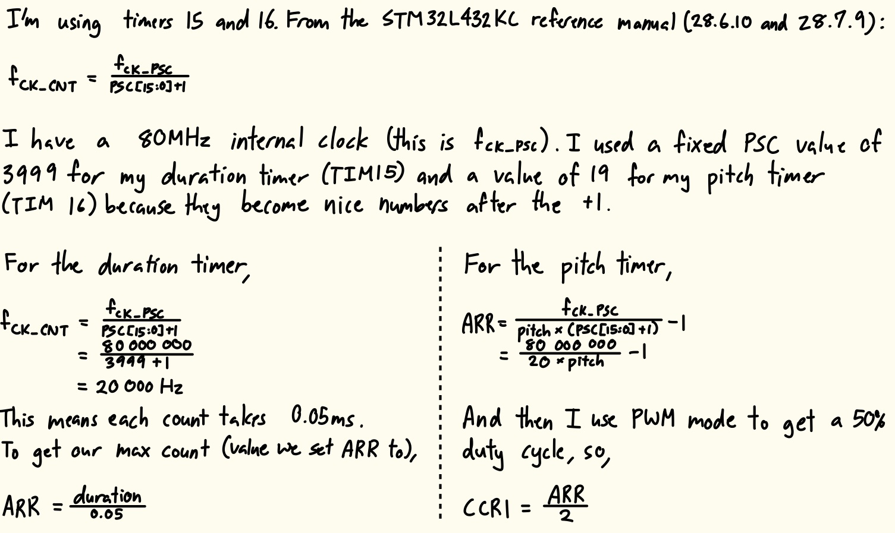
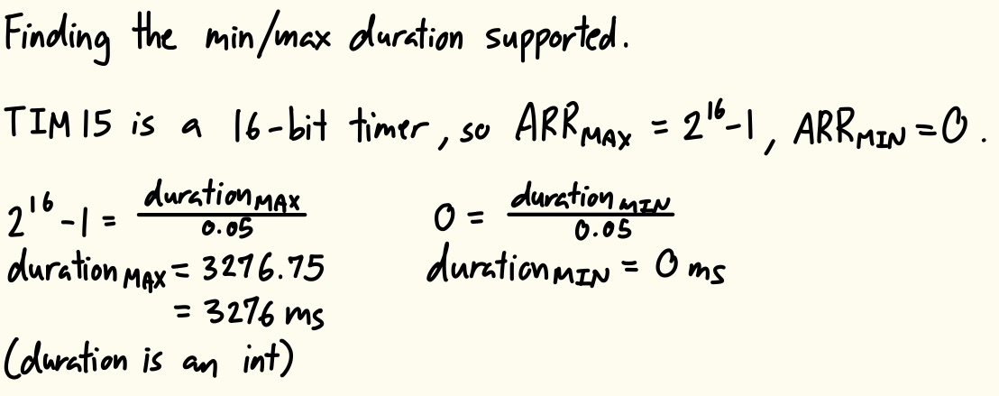
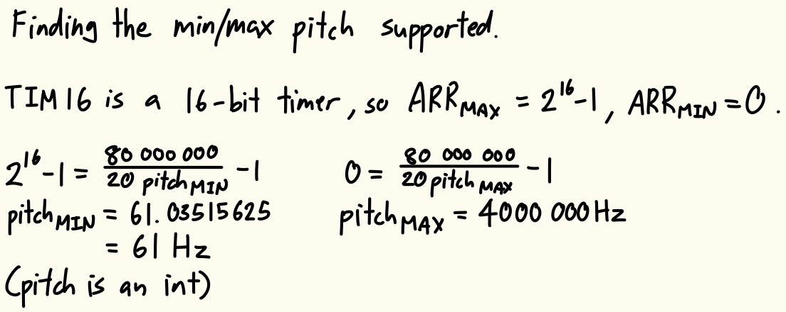
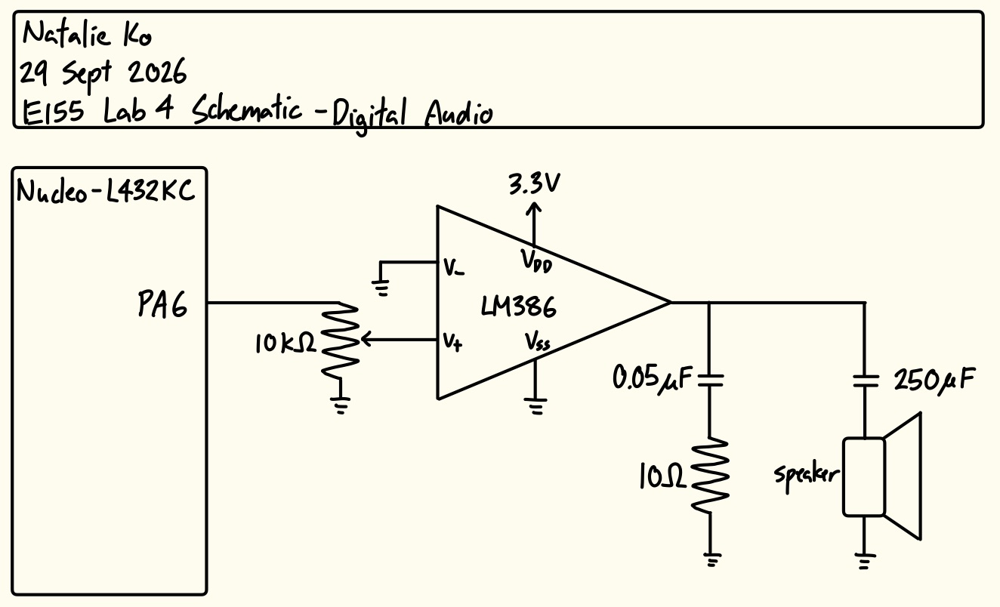
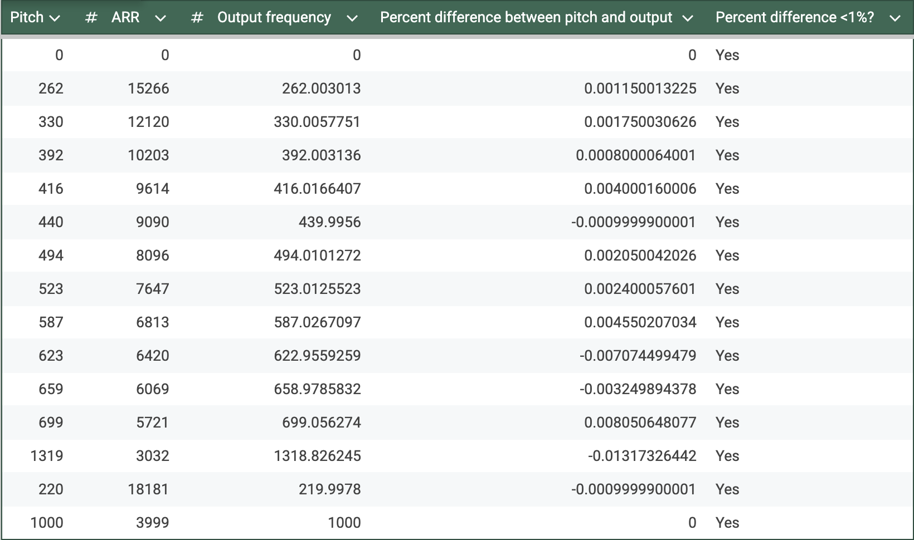

## Introduction
In this lab, a design was implemented on the NUCLEO-32 MCU to utilize timers to generate different pitches and play Für Elise on a speaker.

## Design and Testing Methodology
To design this implementation, two timers were created and linked by main.c. Timers 15 and 16 were chosen over the other timers available because of their PWM generation functionality. The internal clock was set to by 80MHz through using PLL, and this was sent to each timer.

Timer 15 was used to control the duration of each note. I set the frequency and duration of the note through ARR (because PSC was fixed at 3999).

Timer 16 was used to control the pitch of each note. I set the frequency of the note through ARR (because PSC was fixed at 19), then gave the timer a PWM duty cycle of 50% through setting CCR1.

The minimum and maximum duration and pitch are shown in Figures 2 and 3 below.

## Technical Documentation
The source code for the project can be found in the associated [GitHub repository](https://github.com/natalieko2024/E155-Labs/tree/main/E155-Lab4).

### Schematic

The schematic in Figure 4 shows the physical circuit connections outside the PCB. Since the GPIO pins didn't generate enough current to play music directly to the speaker, an LM386 audio amplifier was wired between the pin and speaker to write each note with a gain of 20. A potentiometer was added to control the volume of the sound.

## Results and Discussion
The design met all intended design objectives.

### Calculations

To confirm my design could play all notes in Für Elise accurately, I calculated the percent difference between the intended frequency and the output frequency. As shown in Figure 5, all the pitches, and 220Hz and 1000Hz are under 1% difference.

### Hardware Deployment
This video showcases the design running on the MCU and speaker circuit, successfully playing the Für Elise score.



I also created an additional score, which allowed the design to play the intro to the song "Fireflies".



## Conclusion
The design successfully utilized timers in the MCU to play Für Elise and Fireflies on a speaker.

I spent maybe 10 hours working on this lab. I am also extremely sick so I'm sorry if anything in this report doesn't make sense.

## AI Prototype Summary
::: {.callout-note collapse="true"}
## Click to view LLM output
For generating square waves or PWM signals in the 220Hz to 1kHz range on the **STM32L432KC** (typically found on the Nucleo-32 board), **TIM2** or **TIM15/TIM16** are the best choices.

---

## 1. Best Timer & GPIO Choice

While basic timers like TIM6 and TIM7 lack direct output channels, general-purpose timers connect directly to physical pins via alternate function mapping without needing CPU intervention.

* **Best Choice: TIM2 (Channel 1 on Pin PA0 or PA5)**
* **Why:** TIM2 is a **32-bit general-purpose timer**. The extra bit-depth provides ultra-fine resolution for lower frequencies without risking counter overflow.
* **Pin Assignment:** PA0 (Arduino pin A0 on Nucleo-32) or PA5 (Arduino pin D13) maps directly to `TIM2_CH1` via Alternate Function AF1.

* **Alternative: TIM15 or TIM16**
* Both are 16-bit general-purpose timers available on pins like PB14 / PB15 or PA6.

---

## 2. Relevant Formulae

The output frequency $f_{\text{out}}$ in PWM mode (or Output Compare Toggle mode) is governed by the timer clock frequency $f_{\text{TIMCLK}}$, prescaler (`PSC`), and auto-reload register (`ARR`):

$$f_{\text{out}} = \frac{f_{\text{TIMCLK}}}{(\text{PSC} + 1) \times (\text{ARR} + 1)}$$

To solve for the auto-reload value given a chosen prescaler:

$$\text{ARR} = \left( \frac{f_{\text{TIMCLK}}}{(\text{PSC} + 1) \times f_{\text{out}}} \right) - 1$$

### Duty Cycle Formula (PWM Mode 1)

To achieve a 50% square wave:

$$\text{CCR} = \frac{\text{ARR} + 1}{2}$$

### Example Calculation

Assuming default internal clock $f_{\text{TIMCLK}} = 80\text{ MHz}$ and setting $\text{PSC} = 79$ (tick clock rate of 1 MHz):

| Target Frequency | PSC | ARR Formula Result | ARR Value | CCR (50% Duty) |
| --- | --- | --- | --- | --- |
| **220 Hz** | 79 | $\frac{1,000,000}{220} - 1 = 4544.45$ | **4544** | **2272** |
| **1000 Hz (1 kHz)** | 79 | $\frac{1,000,000}{1000} - 1 = 999$ | **999** | **500** |

---

## 3. Required Registers & Bare-Metal Setup (TIM2 on PA0)

To configure **TIM2 Channel 1** on pin **PA0** to generate a 50% PWM square wave:

### Step 1: Enable Clocks

* **`RCC->AHB2ENR`**: Set `RCC_AHB2ENR_GPIOAEN` (Bit 0) to clock GPIOA.
* **`RCC->APB1ENR1`**: Set `RCC_APB1ENR1_TIM2EN` (Bit 0) to enable TIM2 peripheral clock.

### Step 2: Configure GPIO Pin (PA0 -> AF1)

* **`GPIOA->MODER`**: Set PA0 mode bits to `10` (Alternate Function Mode).
* **`GPIOA->AFR[0]`**: Set `AFSEL0` bits to `0001` (AF1 for `TIM2_CH1`).

### Step 3: Configure Timer Hardware Registers

* **`TIM2->PSC`**: Load the prescaler value (e.g., `79` for a 1 MHz counter clock at 80 MHz input).
* **`TIM2->ARR`**: Load period counter minus 1 (e.g., `4544` for ~220Hz or `999` for 1kHz).
* **`TIM2->CCR1`**: Load compare value for duty cycle (e.g., `ARR / 2`).
* **`TIM2->CCMR1`**:
* Set `OC1M` bits to `0110` (PWM Mode 1: channel active as long as `CNT < CCR1`).
* Set `OC1PE` (Bit 3) to enable preload on compare register.

* **`TIM2->CCER`**: Set `CC1E` (Bit 0) to enable channel 1 output to the physical pin.
* **`TIM2->EGR`**: Set `UG` (Bit 0) to generate an update event and reload shadow registers.
* **`TIM2->CR1`**: Set `CEN` (Bit 0) to start counting.
:::

Above is the LLM output without attaching the datasheet. I thought the output was generally okay. It recommended TIM2 and TIM15/16 over the general-purpose TIM6/7 because TIM6/7 don't have direct output channels. My main issue with its output is that it got the formulas for PSC and ARR wrong. The datasheet directly says $f_{CKCNT} = \frac{f_{CKPSC}}{PSC+1}$, but the LLM said that $f_{CKCNT} = \frac{f_{CKPSC}}{(PSC+1)*(ARR+1)}$. I have no idea where it pulled the additional ARR+1 from. It also said that for a 50% duty cycle, $CCR1 = \frac{ARR+1}{2}$. Again, I don't know where the +1 came from, I'm pretty sure it should just be $CCR1 = \frac{ARR}{2}$. It then contradicted itself in the register mapping portion, where it said $CCR1 = \frac{ARR}{2}$. So I guess you would still have to read the reference manual yourself to find out which one is right.

After attaching the reference manual, it really didn't improve because the formulas were still wrong. However, it did add the fact that the output pins should be configured as Alternate Function pins, which is good.