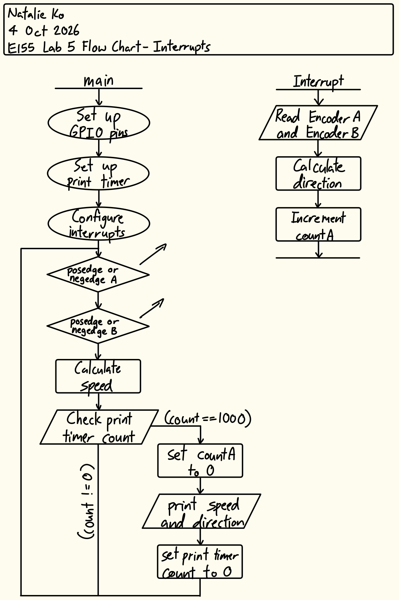
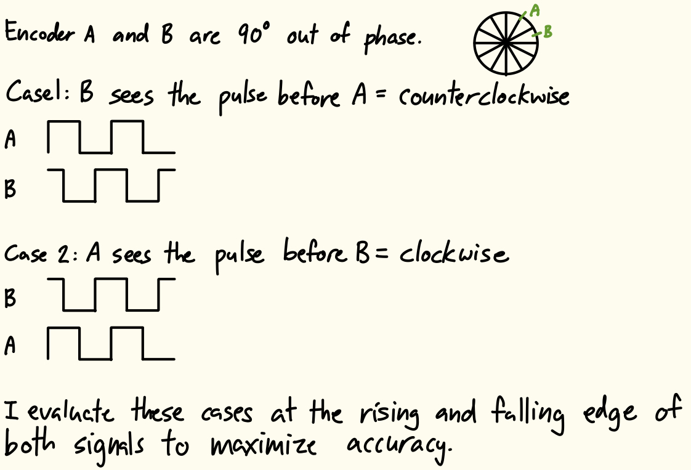
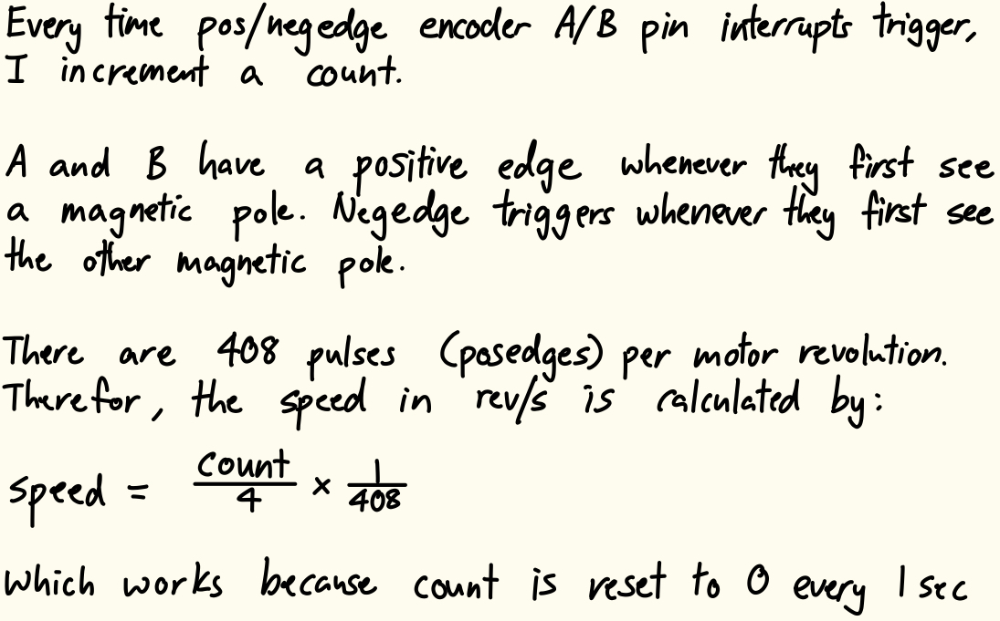
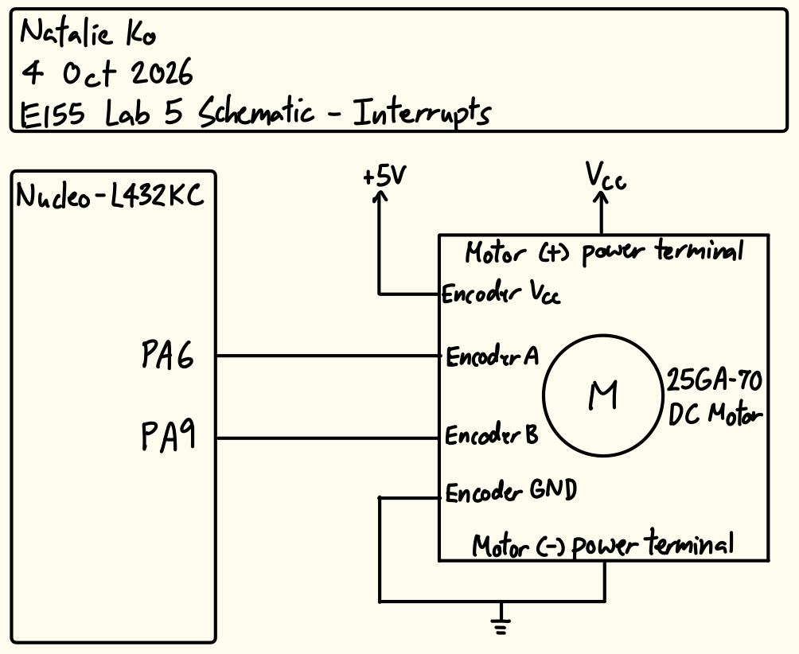

## Introduction
In this lab, a design was implemented on the MCU to accurately determine the speed and direction of a stepper motor through encoder outputs.

## Design and Testing Methodology
The stepper motor has two quadrature encoders with one hall effect sensor each. The sensors are 90° out of phase. To design this implementation, two interrupts were configured to activate at the rising and falling edge of each sensor input. Figure 1 shows a flow chart of the main program and its communications with the interrupt handlers.



Using the collected pin readings, the direction of the motor spin was derived within each interrupt. This was done to maximize the accuracy of the direction at any point in time. The direction derivation logic is shown in Figure 2.



During each interrupt, a count was also incremented. Since the motor has 408 pulses per revolution, Our counter reaches 4*408 every time the motor completes one revolution. The speed (in revolutions per second) was calculated per Figure 3.



The implementation also utilizes a timer to print out the speed and direction at 1Hz. The timer internal clock was configured to run at 10kHz, and when the timer count reached 10000, the speed and direction would print, and then the speed count and print count would both be reset.

Interrupts are the better option compared to manual polling at high speeds, because with this setup, you never miss a rising and falling edge, whereas the polling intervals may not be fine enough, leading to missed edges. Furthermore, polling doesn't guarantee we sample at a rising or falling edge, and we are relying on the fact that the two encoder sensors are 90° out of phase. With manual polling, you could sample within the high/low region of either signal incorrectly assume counterclockwise/clockwise motion.

## Technical Documentation
The source code for the project can be found in the associated [GitHub repository](https://github.com/natalieko2024/E155-Labs/tree/main/E155-Lab5).

### Schematic


The schematic in Figure 5 shows the physical circuit connections outside the PCB. The encoder sensor pins and power pins were connected to the board, while the motor power terminals were connected directly to a voltage source.

## Results and Discussion
The design met all intended design objectives.

### Calculations
![Figure 5. Calculating the resolution]

### Hardware Deployment
This video showcases the design running at various motor speeds and both directions.



## Conclusion
The design successfully utilized interrupts on the MCU to perceive motor speed and direction.

I spend 8.5 hours working on this lab.

## AI Prototype Summary
::: {.callout-note collapse="true"}
## Click to view LLM output
```{systemverilog}
#include "stm32l4xx_hal.h"

TIM_HandleTypeDef htim2;

void MX_TIM2_Encoder_Init(void)
{
    TIM_Encoder_InitTypeDef encoderConfig = {0};
    TIM_MasterConfigTypeDef sMasterConfig = {0};

    htim2.Instance = TIM2;
    htim2.Init.Prescaler = 0;                          // Direct clock feed
    htim2.Init.CounterMode = TIM_COUNTERMODE_UP;
    htim2.Init.Period = 0xFFFFFFFF;                    // Full 32-bit timer period
    htim2.Init.ClockDivision = TIM_CLOCKDIVISION_DIV1;
    htim2.Init.AutoReloadPreload = TIM_AUTORELOAD_PRELOAD_DISABLE;

    // Configure Encoder Mode 3 (X4 quadrature decoding)
    encoderConfig.EncoderMode = TIM_ENCODERMODE_TI12;
    
    // Channel 1 (Phase A) Configuration
    encoderConfig.IC1Polarity = TIM_ICPOLARITY_RISING;
    encoderConfig.IC1Selection = TIM_ICSELECTION_DIRECT_TI;
    encoderConfig.IC1Prescaler = TIM_ICPSC_DIV1;
    encoderConfig.IC1Filter = 10;                     // Hardware input filter (0-15) for noise suppression

    // Channel 2 (Phase B) Configuration
    encoderConfig.IC2Polarity = TIM_ICPOLARITY_RISING;
    encoderConfig.IC2Selection = TIM_ICSELECTION_DIRECT_TI;
    encoderConfig.IC2Prescaler = TIM_ICPSC_DIV1;
    encoderConfig.IC2Filter = 10;                     // Hardware input filter

    if (HAL_TIM_Encoder_Init(&htim2, &encoderConfig) != HAL_OK)
    {
        // Initialization Error
        Error_Handler();
    }

    sMasterConfig.MasterOutputTrigger = TIM_TRGO_RESET;
    sMasterConfig.MasterSlaveMode = TIM_MASTERSLAVEMODE_DISABLE;
    HAL_TIMEx_MasterConfigSynchronization(&htim2, &sMasterConfig);
}

int main(void)
{
    HAL_Init();
    SystemClock_Config();
    MX_GPIO_Init();
    MX_TIM2_Encoder_Init();

    // Start hardware encoder counting
    HAL_TIM_Encoder_Start(&htim2, TIM_CHANNEL_ALL);

    int32_t encoder_position = 0;

    while (1)
    {
        // Read position directly from timer counter register anytime
        encoder_position = (int32_t)__HAL_TIM_GET_COUNTER(&htim2);

        // Your application logic here
        HAL_Delay(10);
    }
}

// EXTI Interrupt Handler for Index/Z Pulse (connected to PA2)
void HAL_GPIO_EXTI_Callback(uint16_t GPIO_Pin)
{
    if (GPIO_Pin == GPIO_PIN_2)
    {
        // Reset the timer counter to zero upon reaching the mechanical index point
        __HAL_TIM_SET_COUNTER(&htim2, 0);
    }
}
```
:::

I couldn't get this LLM code to run at all. Gemini was convinced `#include "stm32l4xx_hal.h"` was valid and when I told it that SEGGER was throwing errors, it kept insisting it was correct. At most, it replaced it with `#define STM32L432xx #include "stm32l4xx_hal.h"`, but this was also invalid. After I force-fed it `#include <stm32l432xx.h>`, I then had to get it to fix the "unknown type name `TIM_HandleTypeDef`" error, which worked, but then it rewrote the entire code. Throughout this whole process, it kept thinking the encoder had an additional pin for an index/z-pulse and assigned the interrupt to this pin, which doesn't make any sense. 

So for the purpose of this project I think LLM code is completely untrustworthy.